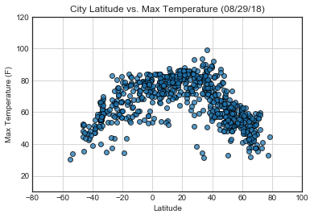
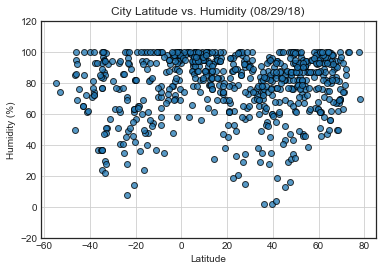
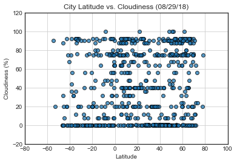
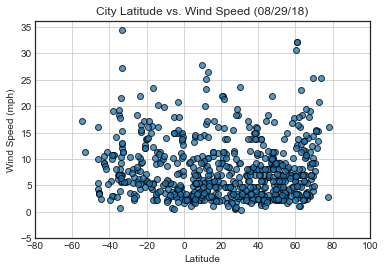

# WeatherPy

### Analysis
* Latitude lines -20, and 40 have the largest range of different temperatures. It would be interesting to see the different types of micro-climates in those regions. 

* It is approaching the end of summer in the nothern hemisphere; you can see that it is generally warmer there. However you can see the temperatures from the southern hemispher slowly rising.. 

* There is no observable relationship with City Latitude and Wind speed. 


```python
import pandas as pd
import matplotlib.pyplot as plt
import numpy as np
import requests
import json
import openweathermapy as ow
import time 


from citipy import citipy
from urllib.error import HTTPError
from pprint import pprint

# make sure to update this with your own key...
from apikeys import api_key
```


```python
coordinates = []
cities = []

# # randomly general coordinates
lat = np.random.uniform(low=-90.000, high=90.000, size=2000)
lng = np.random.uniform(low=-180.000, high=180.000, size=2000)
coordinates = zip(lat, lng)

# for loop for indentifying cities based on coordinates

for coordinate in coordinates:
    city = citipy.nearest_city(coordinate[0], coordinate[1]).city_name
    
    if city not in cities:
           cities.append(city)
            
# I used 2000 as size because it was consistently giving me the required minimum number of unique cities           
len(cities)       
```


    747


```python
cities
```


    ['tuktoyaktuk',
     'chabahar',
     'vaini',
     'port hardy',
     'iqaluit',
     'sorland',
     'rikitea',
     'xichang',
     'longyearbyen',
     'kabo',
     'gemena',
     'bredasdorp',
     'harbour breton',
     'arawa',
     'belaya gora',
     'albany',
     'nikolskoye',
     'mataura',
     'ushtobe',
     'gbarnga',
     'krasnoyarskiy',
     'vila franca do campo',
     'canutama',
     'omboue',
     'busselton',
     'tasiilaq',
     'taolanaro',
     'tuatapere',
     'tsentralnyy',
     'tabiauea',
     'hirara',
     'kilimatinde',
     'samusu',
     'candido mendes',
     'yellowknife',
     'vila velha',
     'mount isa',
     'port alfred',
     'nizhneyansk',
     'upernavik',
     'nanortalik',
     'heyang',
     'shimoda',
     'soyo',
     'seaham',
     'cape town',
     'illoqqortoormiut',
     'kedrovoye',
     'punta arenas',
     'punto fijo',
     'new norfolk',
     'avanigadda',
     'saskylakh',
     'kapaa',
     'marawi',
     'gizo',
     'saldanha',
     'bonavista',
     'hambantota',
     'ahuimanu',
     'upata',
     'carnarvon',
     'hobart',
     'da lat',
     'belushya guba',
     'mucurapo',
     'kalangala',
     'arraial do cabo',
     'thompson',
     'acuna',
     'hermanus',
     'yabrud',
     'port blair',
     'riyadh',
     'amderma',
     'kavieng',
     'avarua',
     'hilo',
     'la grande',
     'trinidad',
     'badaojiang',
     'acapulco',
     'mar del plata',
     'mackenzie',
     'evensk',
     'tumannyy',
     'mys shmidta',
     'wanxian',
     'campo de criptana',
     'igarka',
     'bethel',
     'sorong',
     'barrow',
     'katangli',
     'bluff',
     'ushuaia',
     'gazojak',
     'geraldton',
     'kaitangata',
     'nome',
     'sao felix do xingu',
     'kruisfontein',
     'fuengirola',
     'bolungarvik',
     'manta',
     'katsuura',
     'chokurdakh',
     'butaritari',
     'palmer',
     'annigeri',
     'ribeira grande',
     'tiksi',
     'palabuhanratu',
     'arman',
     'taoudenni',
     'saleaula',
     'los llanos de aridane',
     'port hedland',
     'atuona',
     'gornopravdinsk',
     'yeppoon',
     'te anau',
     'pemberton',
     'torbay',
     'yeletskiy',
     'juneau',
     'dubenskiy',
     'hasaki',
     'suntar',
     'saint george',
     'lavrentiya',
     'prado',
     'salalah',
     'george',
     'ouargaye',
     'talnakh',
     'attawapiskat',
     'solwezi',
     'marcona',
     'sheridan',
     'bambous virieux',
     'lubango',
     'solnechnyy',
     'puerto ayora',
     'tura',
     'mehamn',
     'vicosa do ceara',
     'kazalinsk',
     'santa eulalia del rio',
     'elizabeth city',
     'qaanaaq',
     'naze',
     'mamou',
     'kudahuvadhoo',
     'bandarbeyla',
     'ereymentau',
     'namatanai',
     'metro',
     'mahenge',
     'jamestown',
     'panjab',
     'cabo san lucas',
     'souillac',
     'afgoye',
     'prince rupert',
     'ilulissat',
     'nizwa',
     'rock springs',
     'san patricio',
     'wicklow',
     'vaitupu',
     'bilibino',
     'chapais',
     'khonuu',
     'hithadhoo',
     'saint-philippe',
     'mount gambier',
     'faya',
     'dongsheng',
     'pangnirtung',
     'falun',
     'yulara',
     'lagos',
     'samarai',
     'sur',
     'barentsburg',
     'bayan',
     'fairbanks',
     'tsihombe',
     'san cristobal',
     'alice springs',
     'alofi',
     'morwell',
     'abu kamal',
     'zapolyarnyy',
     'severo-kurilsk',
     'narsaq',
     'east london',
     'dikson',
     'salinopolis',
     'norman wells',
     'debre sina',
     'vao',
     'sibolga',
     'poum',
     'aykhal',
     'wonthaggi',
     'heidenheim',
     'dunedin',
     'pisco',
     'ahipara',
     'tunduru',
     'port keats',
     'albanel',
     'tikhvin',
     'atar',
     'hudson bay',
     'klaksvik',
     'kahului',
     'sayansk',
     'galle',
     'khani',
     'roald',
     'luderitz',
     'krasnokamensk',
     'kimi',
     'kutum',
     'umaria',
     'west bay',
     'chara',
     'provideniya',
     'chuy',
     'jumla',
     'cherskiy',
     'tangara',
     'faanui',
     'mayumba',
     'cayenne',
     'santa rosa',
     'troitsk',
     'bira',
     'mahebourg',
     'vestmanna',
     'oranjestad',
     'clarence town',
     'mount pleasant',
     'nouakchott',
     'abu zabad',
     'chumikan',
     'asau',
     'krasnoarmeysk',
     'castro',
     'dimona',
     'coquimbo',
     'deputatskiy',
     'marathon',
     'san fernando',
     'mykolayivka',
     'temaraia',
     'smoky lake',
     'vung tau',
     'hamilton',
     'thanh hoa',
     'rio grande',
     'rocha',
     'uwayl',
     'nizhniy tsasuchey',
     'fortuna',
     'louisbourg',
     'bay roberts',
     'longido',
     'yuncheng',
     'zeya',
     'itaituba',
     'elban',
     'nkongsamba',
     'marsh harbour',
     'waunakee',
     'san quintin',
     'gerash',
     'umzimvubu',
     'inhambane',
     'manyana',
     'khatanga',
     'skibbereen',
     'tucumcari',
     'sabha',
     'point pedro',
     'san luis',
     'araouane',
     'avera',
     'marystown',
     'kozhva',
     'nishihara',
     'gibara',
     'pahrump',
     'korla',
     'atikokan',
     'kodiak',
     'teguise',
     'sentyabrskiy',
     'cazones',
     'wulanhaote',
     'sao gabriel da cachoeira',
     'tasbuget',
     'srednekolymsk',
     'bajil',
     'shenjiamen',
     'saint-augustin',
     'chake chake',
     'pangai',
     'borlange',
     'leningradskiy',
     'gat',
     'gazanjyk',
     'codrington',
     'fallon',
     'selenginsk',
     'aksarka',
     'haines junction',
     'college',
     'panama city',
     'beringovskiy',
     'san jose',
     'villiers',
     'tarko-sale',
     'hami',
     'necochea',
     'patacamaya',
     'tawang',
     'aden',
     'padang',
     'pevek',
     'tezu',
     'alotau',
     'hihifo',
     'ponta do sol',
     'nouadhibou',
     'nassau',
     'hualmay',
     'luan',
     'kamina',
     'itarema',
     'asfi',
     'la libertad',
     'rawicz',
     'oistins',
     'the pas',
     'olafsvik',
     'georgetown',
     'ponta pora',
     'hanzhong',
     'collie',
     'kadykchan',
     'namibe',
     'victoria',
     'flinders',
     'owando',
     'ancud',
     'noyabrsk',
     'barcarena',
     'katherine',
     'bandarban',
     'mezen',
     'portland',
     'cidreira',
     'ossora',
     'carutapera',
     'corner brook',
     'maralal',
     'kununurra',
     'toora-khem',
     'praia da vitoria',
     'vardo',
     'boueni',
     'oum hadjer',
     'ust-kamchatsk',
     'novyy svit',
     'touros',
     'ryotsu',
     'tommot',
     'okhotsk',
     'half moon bay',
     'kitakata',
     'kyra',
     'samalaeulu',
     'praya',
     'skeldon',
     'hervey bay',
     'dali',
     'limbang',
     'xuchang',
     'spokane',
     'fresnillo',
     'villafranca de los barros',
     'parakai',
     'guerrero negro',
     'copiapo',
     'dajal',
     'tabas',
     'ngukurr',
     'nelson bay',
     'ullapool',
     'constitucion',
     'batu gajah',
     'akhmim',
     'aitape',
     'catamarca',
     'egvekinot',
     'muravlenko',
     'ostersund',
     'arkhangelsk',
     'tateyama',
     'drayton valley',
     'lebu',
     'teya',
     'yanzhou',
     'yaan',
     'batabano',
     'jiuquan',
     'maine-soroa',
     'broome',
     'khartoum',
     'mnogovershinnyy',
     'veraval',
     'qui nhon',
     'warqla',
     'la orilla',
     'douentza',
     'tierralta',
     'manaure',
     'union',
     'dicabisagan',
     'mogwase',
     'mayo',
     'lompoc',
     'daru',
     'sfantu gheorghe',
     'mtambile',
     'nechi',
     'hereford',
     'maryborough',
     'rochegda',
     'pandan',
     'bud',
     'sao filipe',
     'general roca',
     'tigil',
     'la ronge',
     'mana',
     'were ilu',
     'pundaguitan',
     'axim',
     'rafraf',
     'masjed-e soleyman',
     'huarmey',
     'clyde river',
     'bargal',
     'kampot',
     'savonlinna',
     'beyneu',
     'ola',
     'la palma',
     'port-gentil',
     'bengkulu',
     'sistranda',
     'moyale',
     'petropavlovsk-kamchatskiy',
     'trairi',
     'anadyr',
     'richards bay',
     'coihaique',
     'ongandjera',
     'santa marinella',
     'sokoni',
     'cascais',
     'puerto gaitan',
     'scarborough',
     'guadalupe y calvo',
     'rudbar',
     'damavand',
     'airai',
     'delta del tigre',
     'lichfield',
     'unai',
     'nantucket',
     'port elizabeth',
     'antofagasta',
     'aswan',
     'khor',
     'iguape',
     'nikolsk',
     'burica',
     'kathu',
     'garden city',
     'port angeles',
     'farafangana',
     'mitu',
     'bathsheba',
     'montes claros',
     'ruatoria',
     'pontes e lacerda',
     'oga',
     'floro',
     'ust-omchug',
     'lasa',
     'belle glade',
     'tilichiki',
     'dhanera',
     'madison',
     'shubarshi',
     'porbandar',
     'deder',
     'tessalit',
     'takoradi',
     'lata',
     'adrar',
     'karratha',
     'brilon',
     'sao jose da coroa grande',
     'yuzhno-yeniseyskiy',
     'petit goave',
     'isangel',
     'justice',
     'russell',
     'muscat',
     'muli',
     'keskin',
     'svoge',
     'havelock',
     'san policarpo',
     'severobaykalsk',
     'aklavik',
     'qaqortoq',
     'chardara',
     'taksimo',
     'kachikau',
     'loksa',
     'rwamagana',
     'baboua',
     'scalloway',
     'ningyang',
     'erzin',
     'kaniama',
     'kanganpur',
     'biharamulo',
     'bako',
     'beaverlodge',
     'wanaka',
     'naryan-mar',
     'carballo',
     'carnot',
     'sobolevo',
     'pueblo',
     'saint-paul',
     'lamu',
     'kalofer',
     'sabang',
     'haibowan',
     'dwarka',
     'rockport',
     'kloulklubed',
     'husavik',
     'grindavik',
     'pierre',
     'warri',
     'yatou',
     'taywarah',
     'severnyy-kospashskiy',
     'sydney',
     'monastyrshchina',
     'valdivia',
     'lorengau',
     'cozumel',
     'taucha',
     'ust-nera',
     'sol-iletsk',
     'kiama',
     'marzuq',
     'normandin',
     'phalodi',
     'paris',
     'launceston',
     'kavaratti',
     'marsa matruh',
     'french harbor',
     'ouesso',
     'fort nelson',
     'neiafu',
     'merrill',
     'lagoa',
     'vangaindrano',
     'tibu',
     'turukhansk',
     'fort smith',
     'ituni',
     'paamiut',
     'grand river south east',
     'badarpur',
     'sault sainte marie',
     'roebourne',
     'grand gaube',
     'manoel urbano',
     'altamira',
     'san andres',
     'ust-kut',
     'porto belo',
     'ambulu',
     'auki',
     'libourne',
     'tres arroyos',
     'adre',
     'inuvik',
     'port lincoln',
     'lukovetskiy',
     'jolalpan',
     'tuy hoa',
     'kpandu',
     'coahuayana',
     'igurusi',
     'buchanan',
     'colombo',
     'buarcos',
     'krasnoselkup',
     'kattivakkam',
     'mumford',
     'newport',
     'channel-port aux basques',
     'winslow',
     'biloela',
     'putina',
     'pervomayskoye',
     'ostrovnoy',
     'corrales',
     'saint-leu',
     'alyangula',
     'whyalla',
     'formosa do rio preto',
     'kautokeino',
     'jhunjhunun',
     'inongo',
     'hohhot',
     'lolua',
     'svetlogorsk',
     'saint-joseph',
     'presidencia roque saenz pena',
     'zyryanovsk',
     'hokitika',
     'charlestown',
     'preobrazheniye',
     'sola',
     'udachnyy',
     'prince albert',
     'komsomolskiy',
     'pangody',
     'lindi',
     'baymak',
     'macheng',
     'kalach-na-donu',
     'ayagoz',
     'zhangye',
     'plettenberg bay',
     'coos bay',
     'abonnema',
     'dingle',
     'strezhevoy',
     'zalantun',
     'vieux-habitants',
     'palmerston',
     'garowe',
     'ambunti',
     'garbolovo',
     'morristown',
     'sinnamary',
     'benguela',
     'xiaoweizhai',
     'monte alegre',
     'ellisras',
     'road town',
     'tabuk',
     'alekseyevsk',
     'peleduy',
     'darhan',
     'puerto carreno',
     'beloha',
     'milingimbi',
     'filimonovo',
     'aktash',
     'oleksandrivka',
     'negombo',
     'viedma',
     'macaboboni',
     'natal',
     'sitka',
     'rurrenabaque',
     'santa marta',
     'kihei',
     'chapleau',
     'caravelas',
     'gap',
     'karamea',
     'esperance',
     'anloga',
     'urumqi',
     'mocuba',
     'sheltozero',
     'havre-saint-pierre',
     'cockburn town',
     'galesong',
     'khuzhir',
     'berlevag',
     'bokspits',
     'pochutla',
     'banjar',
     'borgarnes',
     'karkaralinsk',
     'kalmunai',
     'the valley',
     'batemans bay',
     'lufilufi',
     'guasdualito',
     'fernie',
     'black river',
     'flores',
     'ulagan',
     'kindu',
     'barcelos',
     'phan thiet',
     'tondano',
     'puerto baquerizo moreno',
     'challapata',
     'diffa',
     'kenai',
     'henties bay',
     'santander',
     'qasigiannguit',
     'kabompo',
     'tolaga bay',
     'bibiani',
     'pangani',
     'hays',
     'kokorevka',
     'dinar',
     'kirakira',
     'totness',
     'tulsipur',
     'akureyri']


## api call


```python
 # Build URL
url = "http://api.openweathermap.org/data/2.5/weather?units=Imperial&APPID=" + api_key 
query_params = {
    'appid': api_key,
    'units': 'imperial'
}

info_keys = ['clouds.all','sys.country','dt','main.humidity','main.temp_max','wind.speed','coord.lat','coord.lon']


#empty lists
cloudiness = []
country = []
date = []
humidity = []
max_temp = []
wind_speed = []
lat =[]
lng =[]
cities_list = []
```


```python
print('Beginning Data Retrieval')
print('---------------------')
counter = 1
for city in cities:
    response = requests.get(url, params=query_params).json()
    city_url = url + '&q=' + city.replace(' ','+')
    print(f'Processing City # {counter} | {city}')
    print(city_url)
    try:
        city_data = ow.get_current(city,**query_params)
        cl,ct,dt,hm,mt,ws,lt,ln = city_data(*info_keys)
        cloudiness.append(cl)
        country.append(ct)
        date.append(dt)
        humidity.append(hm)
        max_temp.append(mt)
        wind_speed.append(ws)
        lat.append(lt)
        lng.append(ln)
        cities_list.append(city)
    except HTTPError:
        print('City not found. skipping...')
    counter += 1
print('---------------------')
print('Data Retrieval Complete')
```

    Beginning Data Retrieval
    ---------------------
    Processing City # 1 | tuktoyaktuk
    http://api.openweathermap.org/data/2.5/weather?units=Imperial&APPID=3df47543f1f64b050a951e7bf50c6c27&q=tuktoyaktuk
    Processing City # 2 | chabahar
    http://api.openweathermap.org/data/2.5/weather?units=Imperial&APPID=3df47543f1f64b050a951e7bf50c6c27&q=chabahar
    Processing City # 3 | vaini
    http://api.openweathermap.org/data/2.5/weather?units=Imperial&APPID=3df47543f1f64b050a951e7bf50c6c27&q=vaini
    Processing City # 4 | port hardy
    http://api.openweathermap.org/data/2.5/weather?units=Imperial&APPID=3df47543f1f64b050a951e7bf50c6c27&q=port+hardy
    Processing City # 5 | iqaluit
    http://api.openweathermap.org/data/2.5/weather?units=Imperial&APPID=3df47543f1f64b050a951e7bf50c6c27&q=iqaluit
    Processing City # 6 | sorland
    http://api.openweathermap.org/data/2.5/weather?units=Imperial&APPID=3df47543f1f64b050a951e7bf50c6c27&q=sorland
    Processing City # 7 | rikitea
    http://api.openweathermap.org/data/2.5/weather?units=Imperial&APPID=3df47543f1f64b050a951e7bf50c6c27&q=rikitea
    Processing City # 8 | xichang
    http://api.openweathermap.org/data/2.5/weather?units=Imperial&APPID=3df47543f1f64b050a951e7bf50c6c27&q=xichang
    Processing City # 9 | longyearbyen
    http://api.openweathermap.org/data/2.5/weather?units=Imperial&APPID=3df47543f1f64b050a951e7bf50c6c27&q=longyearbyen
    Processing City # 10 | kabo
    http://api.openweathermap.org/data/2.5/weather?units=Imperial&APPID=3df47543f1f64b050a951e7bf50c6c27&q=kabo
    Processing City # 11 | gemena
    http://api.openweathermap.org/data/2.5/weather?units=Imperial&APPID=3df47543f1f64b050a951e7bf50c6c27&q=gemena
    Processing City # 12 | bredasdorp
    http://api.openweathermap.org/data/2.5/weather?units=Imperial&APPID=3df47543f1f64b050a951e7bf50c6c27&q=bredasdorp
    Processing City # 13 | harbour breton
    http://api.openweathermap.org/data/2.5/weather?units=Imperial&APPID=3df47543f1f64b050a951e7bf50c6c27&q=harbour+breton
    Processing City # 14 | arawa
    http://api.openweathermap.org/data/2.5/weather?units=Imperial&APPID=3df47543f1f64b050a951e7bf50c6c27&q=arawa
    Processing City # 15 | belaya gora
    http://api.openweathermap.org/data/2.5/weather?units=Imperial&APPID=3df47543f1f64b050a951e7bf50c6c27&q=belaya+gora
    Processing City # 16 | albany
    http://api.openweathermap.org/data/2.5/weather?units=Imperial&APPID=3df47543f1f64b050a951e7bf50c6c27&q=albany
    Processing City # 17 | nikolskoye
    http://api.openweathermap.org/data/2.5/weather?units=Imperial&APPID=3df47543f1f64b050a951e7bf50c6c27&q=nikolskoye
    Processing City # 18 | mataura
    http://api.openweathermap.org/data/2.5/weather?units=Imperial&APPID=3df47543f1f64b050a951e7bf50c6c27&q=mataura
    Processing City # 19 | ushtobe
    http://api.openweathermap.org/data/2.5/weather?units=Imperial&APPID=3df47543f1f64b050a951e7bf50c6c27&q=ushtobe
    Processing City # 20 | gbarnga
    http://api.openweathermap.org/data/2.5/weather?units=Imperial&APPID=3df47543f1f64b050a951e7bf50c6c27&q=gbarnga
    Processing City # 21 | krasnoyarskiy
    http://api.openweathermap.org/data/2.5/weather?units=Imperial&APPID=3df47543f1f64b050a951e7bf50c6c27&q=krasnoyarskiy
    Processing City # 22 | vila franca do campo
    http://api.openweathermap.org/data/2.5/weather?units=Imperial&APPID=3df47543f1f64b050a951e7bf50c6c27&q=vila+franca+do+campo
    Processing City # 23 | canutama
    http://api.openweathermap.org/data/2.5/weather?units=Imperial&APPID=3df47543f1f64b050a951e7bf50c6c27&q=canutama
    Processing City # 24 | omboue
    http://api.openweathermap.org/data/2.5/weather?units=Imperial&APPID=3df47543f1f64b050a951e7bf50c6c27&q=omboue
    Processing City # 25 | busselton
    http://api.openweathermap.org/data/2.5/weather?units=Imperial&APPID=3df47543f1f64b050a951e7bf50c6c27&q=busselton
    Processing City # 26 | tasiilaq
    http://api.openweathermap.org/data/2.5/weather?units=Imperial&APPID=3df47543f1f64b050a951e7bf50c6c27&q=tasiilaq
    Processing City # 27 | taolanaro
    http://api.openweathermap.org/data/2.5/weather?units=Imperial&APPID=3df47543f1f64b050a951e7bf50c6c27&q=taolanaro
    City not found. skipping...
    Processing City # 28 | tuatapere
    http://api.openweathermap.org/data/2.5/weather?units=Imperial&APPID=3df47543f1f64b050a951e7bf50c6c27&q=tuatapere
    Processing City # 29 | tsentralnyy
    http://api.openweathermap.org/data/2.5/weather?units=Imperial&APPID=3df47543f1f64b050a951e7bf50c6c27&q=tsentralnyy
    City not found. skipping...
    Processing City # 30 | tabiauea
    http://api.openweathermap.org/data/2.5/weather?units=Imperial&APPID=3df47543f1f64b050a951e7bf50c6c27&q=tabiauea
    City not found. skipping...
    Processing City # 31 | hirara
    http://api.openweathermap.org/data/2.5/weather?units=Imperial&APPID=3df47543f1f64b050a951e7bf50c6c27&q=hirara
    Processing City # 32 | kilimatinde
    http://api.openweathermap.org/data/2.5/weather?units=Imperial&APPID=3df47543f1f64b050a951e7bf50c6c27&q=kilimatinde
    Processing City # 33 | samusu
    http://api.openweathermap.org/data/2.5/weather?units=Imperial&APPID=3df47543f1f64b050a951e7bf50c6c27&q=samusu
    City not found. skipping...
    Processing City # 34 | candido mendes
    http://api.openweathermap.org/data/2.5/weather?units=Imperial&APPID=3df47543f1f64b050a951e7bf50c6c27&q=candido+mendes
    Processing City # 35 | yellowknife
    http://api.openweathermap.org/data/2.5/weather?units=Imperial&APPID=3df47543f1f64b050a951e7bf50c6c27&q=yellowknife
    Processing City # 36 | vila velha
    http://api.openweathermap.org/data/2.5/weather?units=Imperial&APPID=3df47543f1f64b050a951e7bf50c6c27&q=vila+velha
    Processing City # 37 | mount isa
    http://api.openweathermap.org/data/2.5/weather?units=Imperial&APPID=3df47543f1f64b050a951e7bf50c6c27&q=mount+isa
    Processing City # 38 | port alfred
    http://api.openweathermap.org/data/2.5/weather?units=Imperial&APPID=3df47543f1f64b050a951e7bf50c6c27&q=port+alfred
    Processing City # 39 | nizhneyansk
    http://api.openweathermap.org/data/2.5/weather?units=Imperial&APPID=3df47543f1f64b050a951e7bf50c6c27&q=nizhneyansk
    City not found. skipping...
    Processing City # 40 | upernavik
    http://api.openweathermap.org/data/2.5/weather?units=Imperial&APPID=3df47543f1f64b050a951e7bf50c6c27&q=upernavik
    Processing City # 41 | nanortalik
    http://api.openweathermap.org/data/2.5/weather?units=Imperial&APPID=3df47543f1f64b050a951e7bf50c6c27&q=nanortalik
    Processing City # 42 | heyang
    http://api.openweathermap.org/data/2.5/weather?units=Imperial&APPID=3df47543f1f64b050a951e7bf50c6c27&q=heyang
    Processing City # 43 | shimoda
    http://api.openweathermap.org/data/2.5/weather?units=Imperial&APPID=3df47543f1f64b050a951e7bf50c6c27&q=shimoda
    Processing City # 44 | soyo
    http://api.openweathermap.org/data/2.5/weather?units=Imperial&APPID=3df47543f1f64b050a951e7bf50c6c27&q=soyo
    Processing City # 45 | seaham
    http://api.openweathermap.org/data/2.5/weather?units=Imperial&APPID=3df47543f1f64b050a951e7bf50c6c27&q=seaham
    Processing City # 46 | cape town
    http://api.openweathermap.org/data/2.5/weather?units=Imperial&APPID=3df47543f1f64b050a951e7bf50c6c27&q=cape+town
    Processing City # 47 | illoqqortoormiut
    http://api.openweathermap.org/data/2.5/weather?units=Imperial&APPID=3df47543f1f64b050a951e7bf50c6c27&q=illoqqortoormiut
    City not found. skipping...
    Processing City # 48 | kedrovoye
    http://api.openweathermap.org/data/2.5/weather?units=Imperial&APPID=3df47543f1f64b050a951e7bf50c6c27&q=kedrovoye
    Processing City # 49 | punta arenas
    http://api.openweathermap.org/data/2.5/weather?units=Imperial&APPID=3df47543f1f64b050a951e7bf50c6c27&q=punta+arenas
    Processing City # 50 | punto fijo
    http://api.openweathermap.org/data/2.5/weather?units=Imperial&APPID=3df47543f1f64b050a951e7bf50c6c27&q=punto+fijo
    Processing City # 51 | new norfolk
    http://api.openweathermap.org/data/2.5/weather?units=Imperial&APPID=3df47543f1f64b050a951e7bf50c6c27&q=new+norfolk
    Processing City # 52 | avanigadda
    http://api.openweathermap.org/data/2.5/weather?units=Imperial&APPID=3df47543f1f64b050a951e7bf50c6c27&q=avanigadda
    Processing City # 53 | saskylakh
    http://api.openweathermap.org/data/2.5/weather?units=Imperial&APPID=3df47543f1f64b050a951e7bf50c6c27&q=saskylakh
    Processing City # 54 | kapaa
    http://api.openweathermap.org/data/2.5/weather?units=Imperial&APPID=3df47543f1f64b050a951e7bf50c6c27&q=kapaa
    Processing City # 55 | marawi
    http://api.openweathermap.org/data/2.5/weather?units=Imperial&APPID=3df47543f1f64b050a951e7bf50c6c27&q=marawi
    Processing City # 56 | gizo
    http://api.openweathermap.org/data/2.5/weather?units=Imperial&APPID=3df47543f1f64b050a951e7bf50c6c27&q=gizo
    Processing City # 57 | saldanha
    http://api.openweathermap.org/data/2.5/weather?units=Imperial&APPID=3df47543f1f64b050a951e7bf50c6c27&q=saldanha
    Processing City # 58 | bonavista
    http://api.openweathermap.org/data/2.5/weather?units=Imperial&APPID=3df47543f1f64b050a951e7bf50c6c27&q=bonavista
    Processing City # 59 | hambantota
    http://api.openweathermap.org/data/2.5/weather?units=Imperial&APPID=3df47543f1f64b050a951e7bf50c6c27&q=hambantota
    Processing City # 60 | ahuimanu
    http://api.openweathermap.org/data/2.5/weather?units=Imperial&APPID=3df47543f1f64b050a951e7bf50c6c27&q=ahuimanu
    Processing City # 61 | upata
    http://api.openweathermap.org/data/2.5/weather?units=Imperial&APPID=3df47543f1f64b050a951e7bf50c6c27&q=upata
    Processing City # 62 | carnarvon
    http://api.openweathermap.org/data/2.5/weather?units=Imperial&APPID=3df47543f1f64b050a951e7bf50c6c27&q=carnarvon
    Processing City # 63 | hobart
    http://api.openweathermap.org/data/2.5/weather?units=Imperial&APPID=3df47543f1f64b050a951e7bf50c6c27&q=hobart
    Processing City # 64 | da lat
    http://api.openweathermap.org/data/2.5/weather?units=Imperial&APPID=3df47543f1f64b050a951e7bf50c6c27&q=da+lat
    Processing City # 65 | belushya guba
    http://api.openweathermap.org/data/2.5/weather?units=Imperial&APPID=3df47543f1f64b050a951e7bf50c6c27&q=belushya+guba
    City not found. skipping...
    Processing City # 66 | mucurapo
    http://api.openweathermap.org/data/2.5/weather?units=Imperial&APPID=3df47543f1f64b050a951e7bf50c6c27&q=mucurapo
    Processing City # 67 | kalangala
    http://api.openweathermap.org/data/2.5/weather?units=Imperial&APPID=3df47543f1f64b050a951e7bf50c6c27&q=kalangala
    Processing City # 68 | arraial do cabo
    http://api.openweathermap.org/data/2.5/weather?units=Imperial&APPID=3df47543f1f64b050a951e7bf50c6c27&q=arraial+do+cabo
    Processing City # 69 | thompson
    http://api.openweathermap.org/data/2.5/weather?units=Imperial&APPID=3df47543f1f64b050a951e7bf50c6c27&q=thompson
    Processing City # 70 | acuna
    http://api.openweathermap.org/data/2.5/weather?units=Imperial&APPID=3df47543f1f64b050a951e7bf50c6c27&q=acuna
    City not found. skipping...
    Processing City # 71 | hermanus
    http://api.openweathermap.org/data/2.5/weather?units=Imperial&APPID=3df47543f1f64b050a951e7bf50c6c27&q=hermanus
    Processing City # 72 | yabrud
    http://api.openweathermap.org/data/2.5/weather?units=Imperial&APPID=3df47543f1f64b050a951e7bf50c6c27&q=yabrud
    Processing City # 73 | port blair
    http://api.openweathermap.org/data/2.5/weather?units=Imperial&APPID=3df47543f1f64b050a951e7bf50c6c27&q=port+blair
    Processing City # 74 | riyadh
    http://api.openweathermap.org/data/2.5/weather?units=Imperial&APPID=3df47543f1f64b050a951e7bf50c6c27&q=riyadh
    Processing City # 75 | amderma
    http://api.openweathermap.org/data/2.5/weather?units=Imperial&APPID=3df47543f1f64b050a951e7bf50c6c27&q=amderma
    City not found. skipping...
    Processing City # 76 | kavieng
    http://api.openweathermap.org/data/2.5/weather?units=Imperial&APPID=3df47543f1f64b050a951e7bf50c6c27&q=kavieng
    Processing City # 77 | avarua
    http://api.openweathermap.org/data/2.5/weather?units=Imperial&APPID=3df47543f1f64b050a951e7bf50c6c27&q=avarua
    Processing City # 78 | hilo
    http://api.openweathermap.org/data/2.5/weather?units=Imperial&APPID=3df47543f1f64b050a951e7bf50c6c27&q=hilo
    Processing City # 79 | la grande
    http://api.openweathermap.org/data/2.5/weather?units=Imperial&APPID=3df47543f1f64b050a951e7bf50c6c27&q=la+grande
    Processing City # 80 | trinidad
    http://api.openweathermap.org/data/2.5/weather?units=Imperial&APPID=3df47543f1f64b050a951e7bf50c6c27&q=trinidad
    Processing City # 81 | badaojiang
    http://api.openweathermap.org/data/2.5/weather?units=Imperial&APPID=3df47543f1f64b050a951e7bf50c6c27&q=badaojiang
    City not found. skipping...
    Processing City # 82 | acapulco
    http://api.openweathermap.org/data/2.5/weather?units=Imperial&APPID=3df47543f1f64b050a951e7bf50c6c27&q=acapulco
    Processing City # 83 | mar del plata
    http://api.openweathermap.org/data/2.5/weather?units=Imperial&APPID=3df47543f1f64b050a951e7bf50c6c27&q=mar+del+plata
    Processing City # 84 | mackenzie
    http://api.openweathermap.org/data/2.5/weather?units=Imperial&APPID=3df47543f1f64b050a951e7bf50c6c27&q=mackenzie
    Processing City # 85 | evensk
    http://api.openweathermap.org/data/2.5/weather?units=Imperial&APPID=3df47543f1f64b050a951e7bf50c6c27&q=evensk
    Processing City # 86 | tumannyy
    http://api.openweathermap.org/data/2.5/weather?units=Imperial&APPID=3df47543f1f64b050a951e7bf50c6c27&q=tumannyy
    City not found. skipping...
    Processing City # 87 | mys shmidta
    http://api.openweathermap.org/data/2.5/weather?units=Imperial&APPID=3df47543f1f64b050a951e7bf50c6c27&q=mys+shmidta
    City not found. skipping...
    Processing City # 88 | wanxian
    http://api.openweathermap.org/data/2.5/weather?units=Imperial&APPID=3df47543f1f64b050a951e7bf50c6c27&q=wanxian
    Processing City # 89 | campo de criptana
    http://api.openweathermap.org/data/2.5/weather?units=Imperial&APPID=3df47543f1f64b050a951e7bf50c6c27&q=campo+de+criptana
    Processing City # 90 | igarka
    http://api.openweathermap.org/data/2.5/weather?units=Imperial&APPID=3df47543f1f64b050a951e7bf50c6c27&q=igarka
    Processing City # 91 | bethel
    http://api.openweathermap.org/data/2.5/weather?units=Imperial&APPID=3df47543f1f64b050a951e7bf50c6c27&q=bethel
    Processing City # 92 | sorong
    http://api.openweathermap.org/data/2.5/weather?units=Imperial&APPID=3df47543f1f64b050a951e7bf50c6c27&q=sorong
    Processing City # 93 | barrow
    http://api.openweathermap.org/data/2.5/weather?units=Imperial&APPID=3df47543f1f64b050a951e7bf50c6c27&q=barrow
    Processing City # 94 | katangli
    http://api.openweathermap.org/data/2.5/weather?units=Imperial&APPID=3df47543f1f64b050a951e7bf50c6c27&q=katangli
    Processing City # 95 | bluff
    http://api.openweathermap.org/data/2.5/weather?units=Imperial&APPID=3df47543f1f64b050a951e7bf50c6c27&q=bluff
    Processing City # 96 | ushuaia
    http://api.openweathermap.org/data/2.5/weather?units=Imperial&APPID=3df47543f1f64b050a951e7bf50c6c27&q=ushuaia
    Processing City # 97 | gazojak
    http://api.openweathermap.org/data/2.5/weather?units=Imperial&APPID=3df47543f1f64b050a951e7bf50c6c27&q=gazojak
    Processing City # 98 | geraldton
    http://api.openweathermap.org/data/2.5/weather?units=Imperial&APPID=3df47543f1f64b050a951e7bf50c6c27&q=geraldton
    Processing City # 99 | kaitangata
    http://api.openweathermap.org/data/2.5/weather?units=Imperial&APPID=3df47543f1f64b050a951e7bf50c6c27&q=kaitangata
    Processing City # 100 | nome
    http://api.openweathermap.org/data/2.5/weather?units=Imperial&APPID=3df47543f1f64b050a951e7bf50c6c27&q=nome
    Processing City # 101 | sao felix do xingu
    http://api.openweathermap.org/data/2.5/weather?units=Imperial&APPID=3df47543f1f64b050a951e7bf50c6c27&q=sao+felix+do+xingu
    Processing City # 102 | kruisfontein
    http://api.openweathermap.org/data/2.5/weather?units=Imperial&APPID=3df47543f1f64b050a951e7bf50c6c27&q=kruisfontein
    Processing City # 103 | fuengirola
    http://api.openweathermap.org/data/2.5/weather?units=Imperial&APPID=3df47543f1f64b050a951e7bf50c6c27&q=fuengirola
    Processing City # 104 | bolungarvik
    http://api.openweathermap.org/data/2.5/weather?units=Imperial&APPID=3df47543f1f64b050a951e7bf50c6c27&q=bolungarvik
    City not found. skipping...
    Processing City # 105 | manta
    http://api.openweathermap.org/data/2.5/weather?units=Imperial&APPID=3df47543f1f64b050a951e7bf50c6c27&q=manta
    Processing City # 106 | katsuura
    http://api.openweathermap.org/data/2.5/weather?units=Imperial&APPID=3df47543f1f64b050a951e7bf50c6c27&q=katsuura
    Processing City # 107 | chokurdakh
    http://api.openweathermap.org/data/2.5/weather?units=Imperial&APPID=3df47543f1f64b050a951e7bf50c6c27&q=chokurdakh
    Processing City # 108 | butaritari
    http://api.openweathermap.org/data/2.5/weather?units=Imperial&APPID=3df47543f1f64b050a951e7bf50c6c27&q=butaritari
    Processing City # 109 | palmer
    http://api.openweathermap.org/data/2.5/weather?units=Imperial&APPID=3df47543f1f64b050a951e7bf50c6c27&q=palmer
    Processing City # 110 | annigeri
    http://api.openweathermap.org/data/2.5/weather?units=Imperial&APPID=3df47543f1f64b050a951e7bf50c6c27&q=annigeri
    Processing City # 111 | ribeira grande
    http://api.openweathermap.org/data/2.5/weather?units=Imperial&APPID=3df47543f1f64b050a951e7bf50c6c27&q=ribeira+grande
    Processing City # 112 | tiksi
    http://api.openweathermap.org/data/2.5/weather?units=Imperial&APPID=3df47543f1f64b050a951e7bf50c6c27&q=tiksi
    Processing City # 113 | palabuhanratu
    http://api.openweathermap.org/data/2.5/weather?units=Imperial&APPID=3df47543f1f64b050a951e7bf50c6c27&q=palabuhanratu
    City not found. skipping...
    Processing City # 114 | arman
    http://api.openweathermap.org/data/2.5/weather?units=Imperial&APPID=3df47543f1f64b050a951e7bf50c6c27&q=arman
    Processing City # 115 | taoudenni
    http://api.openweathermap.org/data/2.5/weather?units=Imperial&APPID=3df47543f1f64b050a951e7bf50c6c27&q=taoudenni
    Processing City # 116 | saleaula
    http://api.openweathermap.org/data/2.5/weather?units=Imperial&APPID=3df47543f1f64b050a951e7bf50c6c27&q=saleaula
    City not found. skipping...
    Processing City # 117 | los llanos de aridane
    http://api.openweathermap.org/data/2.5/weather?units=Imperial&APPID=3df47543f1f64b050a951e7bf50c6c27&q=los+llanos+de+aridane
    Processing City # 118 | port hedland
    http://api.openweathermap.org/data/2.5/weather?units=Imperial&APPID=3df47543f1f64b050a951e7bf50c6c27&q=port+hedland
    Processing City # 119 | atuona
    http://api.openweathermap.org/data/2.5/weather?units=Imperial&APPID=3df47543f1f64b050a951e7bf50c6c27&q=atuona
    Processing City # 120 | gornopravdinsk
    http://api.openweathermap.org/data/2.5/weather?units=Imperial&APPID=3df47543f1f64b050a951e7bf50c6c27&q=gornopravdinsk
    Processing City # 121 | yeppoon
    http://api.openweathermap.org/data/2.5/weather?units=Imperial&APPID=3df47543f1f64b050a951e7bf50c6c27&q=yeppoon
    Processing City # 122 | te anau
    http://api.openweathermap.org/data/2.5/weather?units=Imperial&APPID=3df47543f1f64b050a951e7bf50c6c27&q=te+anau
    Processing City # 123 | pemberton
    http://api.openweathermap.org/data/2.5/weather?units=Imperial&APPID=3df47543f1f64b050a951e7bf50c6c27&q=pemberton
    Processing City # 124 | torbay
    http://api.openweathermap.org/data/2.5/weather?units=Imperial&APPID=3df47543f1f64b050a951e7bf50c6c27&q=torbay
    Processing City # 125 | yeletskiy
    http://api.openweathermap.org/data/2.5/weather?units=Imperial&APPID=3df47543f1f64b050a951e7bf50c6c27&q=yeletskiy
    City not found. skipping...
    Processing City # 126 | juneau
    http://api.openweathermap.org/data/2.5/weather?units=Imperial&APPID=3df47543f1f64b050a951e7bf50c6c27&q=juneau
    Processing City # 127 | dubenskiy
    http://api.openweathermap.org/data/2.5/weather?units=Imperial&APPID=3df47543f1f64b050a951e7bf50c6c27&q=dubenskiy
    City not found. skipping...
    Processing City # 128 | hasaki
    http://api.openweathermap.org/data/2.5/weather?units=Imperial&APPID=3df47543f1f64b050a951e7bf50c6c27&q=hasaki
    Processing City # 129 | suntar
    http://api.openweathermap.org/data/2.5/weather?units=Imperial&APPID=3df47543f1f64b050a951e7bf50c6c27&q=suntar
    Processing City # 130 | saint george
    http://api.openweathermap.org/data/2.5/weather?units=Imperial&APPID=3df47543f1f64b050a951e7bf50c6c27&q=saint+george
    Processing City # 131 | lavrentiya
    http://api.openweathermap.org/data/2.5/weather?units=Imperial&APPID=3df47543f1f64b050a951e7bf50c6c27&q=lavrentiya
    Processing City # 132 | prado
    http://api.openweathermap.org/data/2.5/weather?units=Imperial&APPID=3df47543f1f64b050a951e7bf50c6c27&q=prado
    Processing City # 133 | salalah
    http://api.openweathermap.org/data/2.5/weather?units=Imperial&APPID=3df47543f1f64b050a951e7bf50c6c27&q=salalah
    Processing City # 134 | george
    http://api.openweathermap.org/data/2.5/weather?units=Imperial&APPID=3df47543f1f64b050a951e7bf50c6c27&q=george
    Processing City # 135 | ouargaye
    http://api.openweathermap.org/data/2.5/weather?units=Imperial&APPID=3df47543f1f64b050a951e7bf50c6c27&q=ouargaye
    Processing City # 136 | talnakh
    http://api.openweathermap.org/data/2.5/weather?units=Imperial&APPID=3df47543f1f64b050a951e7bf50c6c27&q=talnakh
    Processing City # 137 | attawapiskat
    http://api.openweathermap.org/data/2.5/weather?units=Imperial&APPID=3df47543f1f64b050a951e7bf50c6c27&q=attawapiskat
    City not found. skipping...
    Processing City # 138 | solwezi
    http://api.openweathermap.org/data/2.5/weather?units=Imperial&APPID=3df47543f1f64b050a951e7bf50c6c27&q=solwezi
    Processing City # 139 | marcona
    http://api.openweathermap.org/data/2.5/weather?units=Imperial&APPID=3df47543f1f64b050a951e7bf50c6c27&q=marcona
    City not found. skipping...
    Processing City # 140 | sheridan
    http://api.openweathermap.org/data/2.5/weather?units=Imperial&APPID=3df47543f1f64b050a951e7bf50c6c27&q=sheridan
    Processing City # 141 | bambous virieux
    http://api.openweathermap.org/data/2.5/weather?units=Imperial&APPID=3df47543f1f64b050a951e7bf50c6c27&q=bambous+virieux
    Processing City # 142 | lubango
    http://api.openweathermap.org/data/2.5/weather?units=Imperial&APPID=3df47543f1f64b050a951e7bf50c6c27&q=lubango
    Processing City # 143 | solnechnyy
    http://api.openweathermap.org/data/2.5/weather?units=Imperial&APPID=3df47543f1f64b050a951e7bf50c6c27&q=solnechnyy
    Processing City # 144 | puerto ayora
    http://api.openweathermap.org/data/2.5/weather?units=Imperial&APPID=3df47543f1f64b050a951e7bf50c6c27&q=puerto+ayora
    Processing City # 145 | tura
    http://api.openweathermap.org/data/2.5/weather?units=Imperial&APPID=3df47543f1f64b050a951e7bf50c6c27&q=tura
    Processing City # 146 | mehamn
    http://api.openweathermap.org/data/2.5/weather?units=Imperial&APPID=3df47543f1f64b050a951e7bf50c6c27&q=mehamn
    Processing City # 147 | vicosa do ceara
    http://api.openweathermap.org/data/2.5/weather?units=Imperial&APPID=3df47543f1f64b050a951e7bf50c6c27&q=vicosa+do+ceara
    Processing City # 148 | kazalinsk
    http://api.openweathermap.org/data/2.5/weather?units=Imperial&APPID=3df47543f1f64b050a951e7bf50c6c27&q=kazalinsk
    City not found. skipping...
    Processing City # 149 | santa eulalia del rio
    http://api.openweathermap.org/data/2.5/weather?units=Imperial&APPID=3df47543f1f64b050a951e7bf50c6c27&q=santa+eulalia+del+rio
    City not found. skipping...
    Processing City # 150 | elizabeth city
    http://api.openweathermap.org/data/2.5/weather?units=Imperial&APPID=3df47543f1f64b050a951e7bf50c6c27&q=elizabeth+city
    Processing City # 151 | qaanaaq
    http://api.openweathermap.org/data/2.5/weather?units=Imperial&APPID=3df47543f1f64b050a951e7bf50c6c27&q=qaanaaq
    Processing City # 152 | naze
    http://api.openweathermap.org/data/2.5/weather?units=Imperial&APPID=3df47543f1f64b050a951e7bf50c6c27&q=naze
    Processing City # 153 | mamou
    http://api.openweathermap.org/data/2.5/weather?units=Imperial&APPID=3df47543f1f64b050a951e7bf50c6c27&q=mamou
    Processing City # 154 | kudahuvadhoo
    http://api.openweathermap.org/data/2.5/weather?units=Imperial&APPID=3df47543f1f64b050a951e7bf50c6c27&q=kudahuvadhoo
    Processing City # 155 | bandarbeyla
    http://api.openweathermap.org/data/2.5/weather?units=Imperial&APPID=3df47543f1f64b050a951e7bf50c6c27&q=bandarbeyla
    Processing City # 156 | ereymentau
    http://api.openweathermap.org/data/2.5/weather?units=Imperial&APPID=3df47543f1f64b050a951e7bf50c6c27&q=ereymentau
    Processing City # 157 | namatanai
    http://api.openweathermap.org/data/2.5/weather?units=Imperial&APPID=3df47543f1f64b050a951e7bf50c6c27&q=namatanai
    Processing City # 158 | metro
    http://api.openweathermap.org/data/2.5/weather?units=Imperial&APPID=3df47543f1f64b050a951e7bf50c6c27&q=metro
    Processing City # 159 | mahenge
    http://api.openweathermap.org/data/2.5/weather?units=Imperial&APPID=3df47543f1f64b050a951e7bf50c6c27&q=mahenge
    Processing City # 160 | jamestown
    http://api.openweathermap.org/data/2.5/weather?units=Imperial&APPID=3df47543f1f64b050a951e7bf50c6c27&q=jamestown
    Processing City # 161 | panjab
    http://api.openweathermap.org/data/2.5/weather?units=Imperial&APPID=3df47543f1f64b050a951e7bf50c6c27&q=panjab
    Processing City # 162 | cabo san lucas
    http://api.openweathermap.org/data/2.5/weather?units=Imperial&APPID=3df47543f1f64b050a951e7bf50c6c27&q=cabo+san+lucas
    Processing City # 163 | souillac
    http://api.openweathermap.org/data/2.5/weather?units=Imperial&APPID=3df47543f1f64b050a951e7bf50c6c27&q=souillac
    Processing City # 164 | afgoye
    http://api.openweathermap.org/data/2.5/weather?units=Imperial&APPID=3df47543f1f64b050a951e7bf50c6c27&q=afgoye
    City not found. skipping...
    Processing City # 165 | prince rupert
    http://api.openweathermap.org/data/2.5/weather?units=Imperial&APPID=3df47543f1f64b050a951e7bf50c6c27&q=prince+rupert
    Processing City # 166 | ilulissat
    http://api.openweathermap.org/data/2.5/weather?units=Imperial&APPID=3df47543f1f64b050a951e7bf50c6c27&q=ilulissat
    Processing City # 167 | nizwa
    http://api.openweathermap.org/data/2.5/weather?units=Imperial&APPID=3df47543f1f64b050a951e7bf50c6c27&q=nizwa
    Processing City # 168 | rock springs
    http://api.openweathermap.org/data/2.5/weather?units=Imperial&APPID=3df47543f1f64b050a951e7bf50c6c27&q=rock+springs
    Processing City # 169 | san patricio
    http://api.openweathermap.org/data/2.5/weather?units=Imperial&APPID=3df47543f1f64b050a951e7bf50c6c27&q=san+patricio
    Processing City # 170 | wicklow
    http://api.openweathermap.org/data/2.5/weather?units=Imperial&APPID=3df47543f1f64b050a951e7bf50c6c27&q=wicklow
    Processing City # 171 | vaitupu
    http://api.openweathermap.org/data/2.5/weather?units=Imperial&APPID=3df47543f1f64b050a951e7bf50c6c27&q=vaitupu
    City not found. skipping...
    Processing City # 172 | bilibino
    http://api.openweathermap.org/data/2.5/weather?units=Imperial&APPID=3df47543f1f64b050a951e7bf50c6c27&q=bilibino
    Processing City # 173 | chapais
    http://api.openweathermap.org/data/2.5/weather?units=Imperial&APPID=3df47543f1f64b050a951e7bf50c6c27&q=chapais
    Processing City # 174 | khonuu
    http://api.openweathermap.org/data/2.5/weather?units=Imperial&APPID=3df47543f1f64b050a951e7bf50c6c27&q=khonuu
    City not found. skipping...
    Processing City # 175 | hithadhoo
    http://api.openweathermap.org/data/2.5/weather?units=Imperial&APPID=3df47543f1f64b050a951e7bf50c6c27&q=hithadhoo
    Processing City # 176 | saint-philippe
    http://api.openweathermap.org/data/2.5/weather?units=Imperial&APPID=3df47543f1f64b050a951e7bf50c6c27&q=saint-philippe
    Processing City # 177 | mount gambier
    http://api.openweathermap.org/data/2.5/weather?units=Imperial&APPID=3df47543f1f64b050a951e7bf50c6c27&q=mount+gambier
    Processing City # 178 | faya
    http://api.openweathermap.org/data/2.5/weather?units=Imperial&APPID=3df47543f1f64b050a951e7bf50c6c27&q=faya
    Processing City # 179 | dongsheng
    http://api.openweathermap.org/data/2.5/weather?units=Imperial&APPID=3df47543f1f64b050a951e7bf50c6c27&q=dongsheng
    Processing City # 180 | pangnirtung
    http://api.openweathermap.org/data/2.5/weather?units=Imperial&APPID=3df47543f1f64b050a951e7bf50c6c27&q=pangnirtung
    Processing City # 181 | falun
    http://api.openweathermap.org/data/2.5/weather?units=Imperial&APPID=3df47543f1f64b050a951e7bf50c6c27&q=falun
    Processing City # 182 | yulara
    http://api.openweathermap.org/data/2.5/weather?units=Imperial&APPID=3df47543f1f64b050a951e7bf50c6c27&q=yulara
    Processing City # 183 | lagos
    http://api.openweathermap.org/data/2.5/weather?units=Imperial&APPID=3df47543f1f64b050a951e7bf50c6c27&q=lagos
    Processing City # 184 | samarai
    http://api.openweathermap.org/data/2.5/weather?units=Imperial&APPID=3df47543f1f64b050a951e7bf50c6c27&q=samarai
    Processing City # 185 | sur
    http://api.openweathermap.org/data/2.5/weather?units=Imperial&APPID=3df47543f1f64b050a951e7bf50c6c27&q=sur
    Processing City # 186 | barentsburg
    http://api.openweathermap.org/data/2.5/weather?units=Imperial&APPID=3df47543f1f64b050a951e7bf50c6c27&q=barentsburg
    City not found. skipping...
    Processing City # 187 | bayan
    http://api.openweathermap.org/data/2.5/weather?units=Imperial&APPID=3df47543f1f64b050a951e7bf50c6c27&q=bayan
    Processing City # 188 | fairbanks
    http://api.openweathermap.org/data/2.5/weather?units=Imperial&APPID=3df47543f1f64b050a951e7bf50c6c27&q=fairbanks
    Processing City # 189 | tsihombe
    http://api.openweathermap.org/data/2.5/weather?units=Imperial&APPID=3df47543f1f64b050a951e7bf50c6c27&q=tsihombe
    City not found. skipping...
    Processing City # 190 | san cristobal
    http://api.openweathermap.org/data/2.5/weather?units=Imperial&APPID=3df47543f1f64b050a951e7bf50c6c27&q=san+cristobal
    Processing City # 191 | alice springs
    http://api.openweathermap.org/data/2.5/weather?units=Imperial&APPID=3df47543f1f64b050a951e7bf50c6c27&q=alice+springs
    Processing City # 192 | alofi
    http://api.openweathermap.org/data/2.5/weather?units=Imperial&APPID=3df47543f1f64b050a951e7bf50c6c27&q=alofi
    Processing City # 193 | morwell
    http://api.openweathermap.org/data/2.5/weather?units=Imperial&APPID=3df47543f1f64b050a951e7bf50c6c27&q=morwell
    Processing City # 194 | abu kamal
    http://api.openweathermap.org/data/2.5/weather?units=Imperial&APPID=3df47543f1f64b050a951e7bf50c6c27&q=abu+kamal
    Processing City # 195 | zapolyarnyy
    http://api.openweathermap.org/data/2.5/weather?units=Imperial&APPID=3df47543f1f64b050a951e7bf50c6c27&q=zapolyarnyy
    Processing City # 196 | severo-kurilsk
    http://api.openweathermap.org/data/2.5/weather?units=Imperial&APPID=3df47543f1f64b050a951e7bf50c6c27&q=severo-kurilsk
    Processing City # 197 | narsaq
    http://api.openweathermap.org/data/2.5/weather?units=Imperial&APPID=3df47543f1f64b050a951e7bf50c6c27&q=narsaq
    Processing City # 198 | east london
    http://api.openweathermap.org/data/2.5/weather?units=Imperial&APPID=3df47543f1f64b050a951e7bf50c6c27&q=east+london
    Processing City # 199 | dikson
    http://api.openweathermap.org/data/2.5/weather?units=Imperial&APPID=3df47543f1f64b050a951e7bf50c6c27&q=dikson
    Processing City # 200 | salinopolis
    http://api.openweathermap.org/data/2.5/weather?units=Imperial&APPID=3df47543f1f64b050a951e7bf50c6c27&q=salinopolis
    Processing City # 201 | norman wells
    http://api.openweathermap.org/data/2.5/weather?units=Imperial&APPID=3df47543f1f64b050a951e7bf50c6c27&q=norman+wells
    Processing City # 202 | debre sina
    http://api.openweathermap.org/data/2.5/weather?units=Imperial&APPID=3df47543f1f64b050a951e7bf50c6c27&q=debre+sina
    Processing City # 203 | vao
    http://api.openweathermap.org/data/2.5/weather?units=Imperial&APPID=3df47543f1f64b050a951e7bf50c6c27&q=vao
    Processing City # 204 | sibolga
    http://api.openweathermap.org/data/2.5/weather?units=Imperial&APPID=3df47543f1f64b050a951e7bf50c6c27&q=sibolga
    Processing City # 205 | poum
    http://api.openweathermap.org/data/2.5/weather?units=Imperial&APPID=3df47543f1f64b050a951e7bf50c6c27&q=poum
    Processing City # 206 | aykhal
    http://api.openweathermap.org/data/2.5/weather?units=Imperial&APPID=3df47543f1f64b050a951e7bf50c6c27&q=aykhal
    Processing City # 207 | wonthaggi
    http://api.openweathermap.org/data/2.5/weather?units=Imperial&APPID=3df47543f1f64b050a951e7bf50c6c27&q=wonthaggi
    Processing City # 208 | heidenheim
    http://api.openweathermap.org/data/2.5/weather?units=Imperial&APPID=3df47543f1f64b050a951e7bf50c6c27&q=heidenheim
    Processing City # 209 | dunedin
    http://api.openweathermap.org/data/2.5/weather?units=Imperial&APPID=3df47543f1f64b050a951e7bf50c6c27&q=dunedin
    Processing City # 210 | pisco
    http://api.openweathermap.org/data/2.5/weather?units=Imperial&APPID=3df47543f1f64b050a951e7bf50c6c27&q=pisco
    Processing City # 211 | ahipara
    http://api.openweathermap.org/data/2.5/weather?units=Imperial&APPID=3df47543f1f64b050a951e7bf50c6c27&q=ahipara
    Processing City # 212 | tunduru
    http://api.openweathermap.org/data/2.5/weather?units=Imperial&APPID=3df47543f1f64b050a951e7bf50c6c27&q=tunduru
    City not found. skipping...
    Processing City # 213 | port keats
    http://api.openweathermap.org/data/2.5/weather?units=Imperial&APPID=3df47543f1f64b050a951e7bf50c6c27&q=port+keats
    Processing City # 214 | albanel
    http://api.openweathermap.org/data/2.5/weather?units=Imperial&APPID=3df47543f1f64b050a951e7bf50c6c27&q=albanel
    Processing City # 215 | tikhvin
    http://api.openweathermap.org/data/2.5/weather?units=Imperial&APPID=3df47543f1f64b050a951e7bf50c6c27&q=tikhvin
    Processing City # 216 | atar
    http://api.openweathermap.org/data/2.5/weather?units=Imperial&APPID=3df47543f1f64b050a951e7bf50c6c27&q=atar
    Processing City # 217 | hudson bay
    http://api.openweathermap.org/data/2.5/weather?units=Imperial&APPID=3df47543f1f64b050a951e7bf50c6c27&q=hudson+bay
    Processing City # 218 | klaksvik
    http://api.openweathermap.org/data/2.5/weather?units=Imperial&APPID=3df47543f1f64b050a951e7bf50c6c27&q=klaksvik
    Processing City # 219 | kahului
    http://api.openweathermap.org/data/2.5/weather?units=Imperial&APPID=3df47543f1f64b050a951e7bf50c6c27&q=kahului
    Processing City # 220 | sayansk
    http://api.openweathermap.org/data/2.5/weather?units=Imperial&APPID=3df47543f1f64b050a951e7bf50c6c27&q=sayansk
    Processing City # 221 | galle
    http://api.openweathermap.org/data/2.5/weather?units=Imperial&APPID=3df47543f1f64b050a951e7bf50c6c27&q=galle
    Processing City # 222 | khani
    http://api.openweathermap.org/data/2.5/weather?units=Imperial&APPID=3df47543f1f64b050a951e7bf50c6c27&q=khani
    Processing City # 223 | roald
    http://api.openweathermap.org/data/2.5/weather?units=Imperial&APPID=3df47543f1f64b050a951e7bf50c6c27&q=roald
    Processing City # 224 | luderitz
    http://api.openweathermap.org/data/2.5/weather?units=Imperial&APPID=3df47543f1f64b050a951e7bf50c6c27&q=luderitz
    Processing City # 225 | krasnokamensk
    http://api.openweathermap.org/data/2.5/weather?units=Imperial&APPID=3df47543f1f64b050a951e7bf50c6c27&q=krasnokamensk
    Processing City # 226 | kimi
    http://api.openweathermap.org/data/2.5/weather?units=Imperial&APPID=3df47543f1f64b050a951e7bf50c6c27&q=kimi
    City not found. skipping...
    Processing City # 227 | kutum
    http://api.openweathermap.org/data/2.5/weather?units=Imperial&APPID=3df47543f1f64b050a951e7bf50c6c27&q=kutum
    Processing City # 228 | umaria
    http://api.openweathermap.org/data/2.5/weather?units=Imperial&APPID=3df47543f1f64b050a951e7bf50c6c27&q=umaria
    Processing City # 229 | west bay
    http://api.openweathermap.org/data/2.5/weather?units=Imperial&APPID=3df47543f1f64b050a951e7bf50c6c27&q=west+bay
    Processing City # 230 | chara
    http://api.openweathermap.org/data/2.5/weather?units=Imperial&APPID=3df47543f1f64b050a951e7bf50c6c27&q=chara
    Processing City # 231 | provideniya
    http://api.openweathermap.org/data/2.5/weather?units=Imperial&APPID=3df47543f1f64b050a951e7bf50c6c27&q=provideniya
    Processing City # 232 | chuy
    http://api.openweathermap.org/data/2.5/weather?units=Imperial&APPID=3df47543f1f64b050a951e7bf50c6c27&q=chuy
    Processing City # 233 | jumla
    http://api.openweathermap.org/data/2.5/weather?units=Imperial&APPID=3df47543f1f64b050a951e7bf50c6c27&q=jumla
    Processing City # 234 | cherskiy
    http://api.openweathermap.org/data/2.5/weather?units=Imperial&APPID=3df47543f1f64b050a951e7bf50c6c27&q=cherskiy
    Processing City # 235 | tangara
    http://api.openweathermap.org/data/2.5/weather?units=Imperial&APPID=3df47543f1f64b050a951e7bf50c6c27&q=tangara
    Processing City # 236 | faanui
    http://api.openweathermap.org/data/2.5/weather?units=Imperial&APPID=3df47543f1f64b050a951e7bf50c6c27&q=faanui
    Processing City # 237 | mayumba
    http://api.openweathermap.org/data/2.5/weather?units=Imperial&APPID=3df47543f1f64b050a951e7bf50c6c27&q=mayumba
    Processing City # 238 | cayenne
    http://api.openweathermap.org/data/2.5/weather?units=Imperial&APPID=3df47543f1f64b050a951e7bf50c6c27&q=cayenne
    Processing City # 239 | santa rosa
    http://api.openweathermap.org/data/2.5/weather?units=Imperial&APPID=3df47543f1f64b050a951e7bf50c6c27&q=santa+rosa
    Processing City # 240 | troitsk
    http://api.openweathermap.org/data/2.5/weather?units=Imperial&APPID=3df47543f1f64b050a951e7bf50c6c27&q=troitsk
    Processing City # 241 | bira
    http://api.openweathermap.org/data/2.5/weather?units=Imperial&APPID=3df47543f1f64b050a951e7bf50c6c27&q=bira
    Processing City # 242 | mahebourg
    http://api.openweathermap.org/data/2.5/weather?units=Imperial&APPID=3df47543f1f64b050a951e7bf50c6c27&q=mahebourg
    Processing City # 243 | vestmanna
    http://api.openweathermap.org/data/2.5/weather?units=Imperial&APPID=3df47543f1f64b050a951e7bf50c6c27&q=vestmanna
    Processing City # 244 | oranjestad
    http://api.openweathermap.org/data/2.5/weather?units=Imperial&APPID=3df47543f1f64b050a951e7bf50c6c27&q=oranjestad
    Processing City # 245 | clarence town
    http://api.openweathermap.org/data/2.5/weather?units=Imperial&APPID=3df47543f1f64b050a951e7bf50c6c27&q=clarence+town
    Processing City # 246 | mount pleasant
    http://api.openweathermap.org/data/2.5/weather?units=Imperial&APPID=3df47543f1f64b050a951e7bf50c6c27&q=mount+pleasant
    Processing City # 247 | nouakchott
    http://api.openweathermap.org/data/2.5/weather?units=Imperial&APPID=3df47543f1f64b050a951e7bf50c6c27&q=nouakchott
    Processing City # 248 | abu zabad
    http://api.openweathermap.org/data/2.5/weather?units=Imperial&APPID=3df47543f1f64b050a951e7bf50c6c27&q=abu+zabad
    Processing City # 249 | chumikan
    http://api.openweathermap.org/data/2.5/weather?units=Imperial&APPID=3df47543f1f64b050a951e7bf50c6c27&q=chumikan
    Processing City # 250 | asau
    http://api.openweathermap.org/data/2.5/weather?units=Imperial&APPID=3df47543f1f64b050a951e7bf50c6c27&q=asau
    City not found. skipping...
    Processing City # 251 | krasnoarmeysk
    http://api.openweathermap.org/data/2.5/weather?units=Imperial&APPID=3df47543f1f64b050a951e7bf50c6c27&q=krasnoarmeysk
    Processing City # 252 | castro
    http://api.openweathermap.org/data/2.5/weather?units=Imperial&APPID=3df47543f1f64b050a951e7bf50c6c27&q=castro
    Processing City # 253 | dimona
    http://api.openweathermap.org/data/2.5/weather?units=Imperial&APPID=3df47543f1f64b050a951e7bf50c6c27&q=dimona
    Processing City # 254 | coquimbo
    http://api.openweathermap.org/data/2.5/weather?units=Imperial&APPID=3df47543f1f64b050a951e7bf50c6c27&q=coquimbo
    Processing City # 255 | deputatskiy
    http://api.openweathermap.org/data/2.5/weather?units=Imperial&APPID=3df47543f1f64b050a951e7bf50c6c27&q=deputatskiy
    Processing City # 256 | marathon
    http://api.openweathermap.org/data/2.5/weather?units=Imperial&APPID=3df47543f1f64b050a951e7bf50c6c27&q=marathon
    Processing City # 257 | san fernando
    http://api.openweathermap.org/data/2.5/weather?units=Imperial&APPID=3df47543f1f64b050a951e7bf50c6c27&q=san+fernando
    Processing City # 258 | mykolayivka
    http://api.openweathermap.org/data/2.5/weather?units=Imperial&APPID=3df47543f1f64b050a951e7bf50c6c27&q=mykolayivka
    Processing City # 259 | temaraia
    http://api.openweathermap.org/data/2.5/weather?units=Imperial&APPID=3df47543f1f64b050a951e7bf50c6c27&q=temaraia
    City not found. skipping...
    Processing City # 260 | smoky lake
    http://api.openweathermap.org/data/2.5/weather?units=Imperial&APPID=3df47543f1f64b050a951e7bf50c6c27&q=smoky+lake
    Processing City # 261 | vung tau
    http://api.openweathermap.org/data/2.5/weather?units=Imperial&APPID=3df47543f1f64b050a951e7bf50c6c27&q=vung+tau
    Processing City # 262 | hamilton
    http://api.openweathermap.org/data/2.5/weather?units=Imperial&APPID=3df47543f1f64b050a951e7bf50c6c27&q=hamilton
    Processing City # 263 | thanh hoa
    http://api.openweathermap.org/data/2.5/weather?units=Imperial&APPID=3df47543f1f64b050a951e7bf50c6c27&q=thanh+hoa
    Processing City # 264 | rio grande
    http://api.openweathermap.org/data/2.5/weather?units=Imperial&APPID=3df47543f1f64b050a951e7bf50c6c27&q=rio+grande
    Processing City # 265 | rocha
    http://api.openweathermap.org/data/2.5/weather?units=Imperial&APPID=3df47543f1f64b050a951e7bf50c6c27&q=rocha
    Processing City # 266 | uwayl
    http://api.openweathermap.org/data/2.5/weather?units=Imperial&APPID=3df47543f1f64b050a951e7bf50c6c27&q=uwayl
    City not found. skipping...
    Processing City # 267 | nizhniy tsasuchey
    http://api.openweathermap.org/data/2.5/weather?units=Imperial&APPID=3df47543f1f64b050a951e7bf50c6c27&q=nizhniy+tsasuchey
    Processing City # 268 | fortuna
    http://api.openweathermap.org/data/2.5/weather?units=Imperial&APPID=3df47543f1f64b050a951e7bf50c6c27&q=fortuna
    Processing City # 269 | louisbourg
    http://api.openweathermap.org/data/2.5/weather?units=Imperial&APPID=3df47543f1f64b050a951e7bf50c6c27&q=louisbourg
    City not found. skipping...
    Processing City # 270 | bay roberts
    http://api.openweathermap.org/data/2.5/weather?units=Imperial&APPID=3df47543f1f64b050a951e7bf50c6c27&q=bay+roberts
    Processing City # 271 | longido
    http://api.openweathermap.org/data/2.5/weather?units=Imperial&APPID=3df47543f1f64b050a951e7bf50c6c27&q=longido
    Processing City # 272 | yuncheng
    http://api.openweathermap.org/data/2.5/weather?units=Imperial&APPID=3df47543f1f64b050a951e7bf50c6c27&q=yuncheng
    Processing City # 273 | zeya
    http://api.openweathermap.org/data/2.5/weather?units=Imperial&APPID=3df47543f1f64b050a951e7bf50c6c27&q=zeya
    Processing City # 274 | itaituba
    http://api.openweathermap.org/data/2.5/weather?units=Imperial&APPID=3df47543f1f64b050a951e7bf50c6c27&q=itaituba
    Processing City # 275 | elban
    http://api.openweathermap.org/data/2.5/weather?units=Imperial&APPID=3df47543f1f64b050a951e7bf50c6c27&q=elban
    Processing City # 276 | nkongsamba
    http://api.openweathermap.org/data/2.5/weather?units=Imperial&APPID=3df47543f1f64b050a951e7bf50c6c27&q=nkongsamba
    Processing City # 277 | marsh harbour
    http://api.openweathermap.org/data/2.5/weather?units=Imperial&APPID=3df47543f1f64b050a951e7bf50c6c27&q=marsh+harbour
    Processing City # 278 | waunakee
    http://api.openweathermap.org/data/2.5/weather?units=Imperial&APPID=3df47543f1f64b050a951e7bf50c6c27&q=waunakee
    Processing City # 279 | san quintin
    http://api.openweathermap.org/data/2.5/weather?units=Imperial&APPID=3df47543f1f64b050a951e7bf50c6c27&q=san+quintin
    Processing City # 280 | gerash
    http://api.openweathermap.org/data/2.5/weather?units=Imperial&APPID=3df47543f1f64b050a951e7bf50c6c27&q=gerash
    Processing City # 281 | umzimvubu
    http://api.openweathermap.org/data/2.5/weather?units=Imperial&APPID=3df47543f1f64b050a951e7bf50c6c27&q=umzimvubu
    City not found. skipping...
    Processing City # 282 | inhambane
    http://api.openweathermap.org/data/2.5/weather?units=Imperial&APPID=3df47543f1f64b050a951e7bf50c6c27&q=inhambane
    Processing City # 283 | manyana
    http://api.openweathermap.org/data/2.5/weather?units=Imperial&APPID=3df47543f1f64b050a951e7bf50c6c27&q=manyana
    Processing City # 284 | khatanga
    http://api.openweathermap.org/data/2.5/weather?units=Imperial&APPID=3df47543f1f64b050a951e7bf50c6c27&q=khatanga
    Processing City # 285 | skibbereen
    http://api.openweathermap.org/data/2.5/weather?units=Imperial&APPID=3df47543f1f64b050a951e7bf50c6c27&q=skibbereen
    Processing City # 286 | tucumcari
    http://api.openweathermap.org/data/2.5/weather?units=Imperial&APPID=3df47543f1f64b050a951e7bf50c6c27&q=tucumcari
    Processing City # 287 | sabha
    http://api.openweathermap.org/data/2.5/weather?units=Imperial&APPID=3df47543f1f64b050a951e7bf50c6c27&q=sabha
    Processing City # 288 | point pedro
    http://api.openweathermap.org/data/2.5/weather?units=Imperial&APPID=3df47543f1f64b050a951e7bf50c6c27&q=point+pedro
    Processing City # 289 | san luis
    http://api.openweathermap.org/data/2.5/weather?units=Imperial&APPID=3df47543f1f64b050a951e7bf50c6c27&q=san+luis
    Processing City # 290 | araouane
    http://api.openweathermap.org/data/2.5/weather?units=Imperial&APPID=3df47543f1f64b050a951e7bf50c6c27&q=araouane
    Processing City # 291 | avera
    http://api.openweathermap.org/data/2.5/weather?units=Imperial&APPID=3df47543f1f64b050a951e7bf50c6c27&q=avera
    Processing City # 292 | marystown
    http://api.openweathermap.org/data/2.5/weather?units=Imperial&APPID=3df47543f1f64b050a951e7bf50c6c27&q=marystown
    Processing City # 293 | kozhva
    http://api.openweathermap.org/data/2.5/weather?units=Imperial&APPID=3df47543f1f64b050a951e7bf50c6c27&q=kozhva
    Processing City # 294 | nishihara
    http://api.openweathermap.org/data/2.5/weather?units=Imperial&APPID=3df47543f1f64b050a951e7bf50c6c27&q=nishihara
    Processing City # 295 | gibara
    http://api.openweathermap.org/data/2.5/weather?units=Imperial&APPID=3df47543f1f64b050a951e7bf50c6c27&q=gibara
    Processing City # 296 | pahrump
    http://api.openweathermap.org/data/2.5/weather?units=Imperial&APPID=3df47543f1f64b050a951e7bf50c6c27&q=pahrump
    Processing City # 297 | korla
    http://api.openweathermap.org/data/2.5/weather?units=Imperial&APPID=3df47543f1f64b050a951e7bf50c6c27&q=korla
    City not found. skipping...
    Processing City # 298 | atikokan
    http://api.openweathermap.org/data/2.5/weather?units=Imperial&APPID=3df47543f1f64b050a951e7bf50c6c27&q=atikokan
    Processing City # 299 | kodiak
    http://api.openweathermap.org/data/2.5/weather?units=Imperial&APPID=3df47543f1f64b050a951e7bf50c6c27&q=kodiak
    Processing City # 300 | teguise
    http://api.openweathermap.org/data/2.5/weather?units=Imperial&APPID=3df47543f1f64b050a951e7bf50c6c27&q=teguise
    Processing City # 301 | sentyabrskiy
    http://api.openweathermap.org/data/2.5/weather?units=Imperial&APPID=3df47543f1f64b050a951e7bf50c6c27&q=sentyabrskiy
    City not found. skipping...
    Processing City # 302 | cazones
    http://api.openweathermap.org/data/2.5/weather?units=Imperial&APPID=3df47543f1f64b050a951e7bf50c6c27&q=cazones
    Processing City # 303 | wulanhaote
    http://api.openweathermap.org/data/2.5/weather?units=Imperial&APPID=3df47543f1f64b050a951e7bf50c6c27&q=wulanhaote
    City not found. skipping...
    Processing City # 304 | sao gabriel da cachoeira
    http://api.openweathermap.org/data/2.5/weather?units=Imperial&APPID=3df47543f1f64b050a951e7bf50c6c27&q=sao+gabriel+da+cachoeira
    Processing City # 305 | tasbuget
    http://api.openweathermap.org/data/2.5/weather?units=Imperial&APPID=3df47543f1f64b050a951e7bf50c6c27&q=tasbuget
    City not found. skipping...
    Processing City # 306 | srednekolymsk
    http://api.openweathermap.org/data/2.5/weather?units=Imperial&APPID=3df47543f1f64b050a951e7bf50c6c27&q=srednekolymsk
    Processing City # 307 | bajil
    http://api.openweathermap.org/data/2.5/weather?units=Imperial&APPID=3df47543f1f64b050a951e7bf50c6c27&q=bajil
    Processing City # 308 | shenjiamen
    http://api.openweathermap.org/data/2.5/weather?units=Imperial&APPID=3df47543f1f64b050a951e7bf50c6c27&q=shenjiamen
    Processing City # 309 | saint-augustin
    http://api.openweathermap.org/data/2.5/weather?units=Imperial&APPID=3df47543f1f64b050a951e7bf50c6c27&q=saint-augustin
    Processing City # 310 | chake chake
    http://api.openweathermap.org/data/2.5/weather?units=Imperial&APPID=3df47543f1f64b050a951e7bf50c6c27&q=chake+chake
    Processing City # 311 | pangai
    http://api.openweathermap.org/data/2.5/weather?units=Imperial&APPID=3df47543f1f64b050a951e7bf50c6c27&q=pangai
    Processing City # 312 | borlange
    http://api.openweathermap.org/data/2.5/weather?units=Imperial&APPID=3df47543f1f64b050a951e7bf50c6c27&q=borlange
    City not found. skipping...
    Processing City # 313 | leningradskiy
    http://api.openweathermap.org/data/2.5/weather?units=Imperial&APPID=3df47543f1f64b050a951e7bf50c6c27&q=leningradskiy
    Processing City # 314 | gat
    http://api.openweathermap.org/data/2.5/weather?units=Imperial&APPID=3df47543f1f64b050a951e7bf50c6c27&q=gat
    Processing City # 315 | gazanjyk
    http://api.openweathermap.org/data/2.5/weather?units=Imperial&APPID=3df47543f1f64b050a951e7bf50c6c27&q=gazanjyk
    Processing City # 316 | codrington
    http://api.openweathermap.org/data/2.5/weather?units=Imperial&APPID=3df47543f1f64b050a951e7bf50c6c27&q=codrington
    Processing City # 317 | fallon
    http://api.openweathermap.org/data/2.5/weather?units=Imperial&APPID=3df47543f1f64b050a951e7bf50c6c27&q=fallon
    Processing City # 318 | selenginsk
    http://api.openweathermap.org/data/2.5/weather?units=Imperial&APPID=3df47543f1f64b050a951e7bf50c6c27&q=selenginsk
    Processing City # 319 | aksarka
    http://api.openweathermap.org/data/2.5/weather?units=Imperial&APPID=3df47543f1f64b050a951e7bf50c6c27&q=aksarka
    Processing City # 320 | haines junction
    http://api.openweathermap.org/data/2.5/weather?units=Imperial&APPID=3df47543f1f64b050a951e7bf50c6c27&q=haines+junction
    Processing City # 321 | college
    http://api.openweathermap.org/data/2.5/weather?units=Imperial&APPID=3df47543f1f64b050a951e7bf50c6c27&q=college
    Processing City # 322 | panama city
    http://api.openweathermap.org/data/2.5/weather?units=Imperial&APPID=3df47543f1f64b050a951e7bf50c6c27&q=panama+city
    Processing City # 323 | beringovskiy
    http://api.openweathermap.org/data/2.5/weather?units=Imperial&APPID=3df47543f1f64b050a951e7bf50c6c27&q=beringovskiy
    Processing City # 324 | san jose
    http://api.openweathermap.org/data/2.5/weather?units=Imperial&APPID=3df47543f1f64b050a951e7bf50c6c27&q=san+jose
    Processing City # 325 | villiers
    http://api.openweathermap.org/data/2.5/weather?units=Imperial&APPID=3df47543f1f64b050a951e7bf50c6c27&q=villiers
    Processing City # 326 | tarko-sale
    http://api.openweathermap.org/data/2.5/weather?units=Imperial&APPID=3df47543f1f64b050a951e7bf50c6c27&q=tarko-sale
    Processing City # 327 | hami
    http://api.openweathermap.org/data/2.5/weather?units=Imperial&APPID=3df47543f1f64b050a951e7bf50c6c27&q=hami
    Processing City # 328 | necochea
    http://api.openweathermap.org/data/2.5/weather?units=Imperial&APPID=3df47543f1f64b050a951e7bf50c6c27&q=necochea
    Processing City # 329 | patacamaya
    http://api.openweathermap.org/data/2.5/weather?units=Imperial&APPID=3df47543f1f64b050a951e7bf50c6c27&q=patacamaya
    Processing City # 330 | tawang
    http://api.openweathermap.org/data/2.5/weather?units=Imperial&APPID=3df47543f1f64b050a951e7bf50c6c27&q=tawang
    Processing City # 331 | aden
    http://api.openweathermap.org/data/2.5/weather?units=Imperial&APPID=3df47543f1f64b050a951e7bf50c6c27&q=aden
    Processing City # 332 | padang
    http://api.openweathermap.org/data/2.5/weather?units=Imperial&APPID=3df47543f1f64b050a951e7bf50c6c27&q=padang
    Processing City # 333 | pevek
    http://api.openweathermap.org/data/2.5/weather?units=Imperial&APPID=3df47543f1f64b050a951e7bf50c6c27&q=pevek
    Processing City # 334 | tezu
    http://api.openweathermap.org/data/2.5/weather?units=Imperial&APPID=3df47543f1f64b050a951e7bf50c6c27&q=tezu
    Processing City # 335 | alotau
    http://api.openweathermap.org/data/2.5/weather?units=Imperial&APPID=3df47543f1f64b050a951e7bf50c6c27&q=alotau
    City not found. skipping...
    Processing City # 336 | hihifo
    http://api.openweathermap.org/data/2.5/weather?units=Imperial&APPID=3df47543f1f64b050a951e7bf50c6c27&q=hihifo
    City not found. skipping...
    Processing City # 337 | ponta do sol
    http://api.openweathermap.org/data/2.5/weather?units=Imperial&APPID=3df47543f1f64b050a951e7bf50c6c27&q=ponta+do+sol
    Processing City # 338 | nouadhibou
    http://api.openweathermap.org/data/2.5/weather?units=Imperial&APPID=3df47543f1f64b050a951e7bf50c6c27&q=nouadhibou
    Processing City # 339 | nassau
    http://api.openweathermap.org/data/2.5/weather?units=Imperial&APPID=3df47543f1f64b050a951e7bf50c6c27&q=nassau
    Processing City # 340 | hualmay
    http://api.openweathermap.org/data/2.5/weather?units=Imperial&APPID=3df47543f1f64b050a951e7bf50c6c27&q=hualmay
    Processing City # 341 | luan
    http://api.openweathermap.org/data/2.5/weather?units=Imperial&APPID=3df47543f1f64b050a951e7bf50c6c27&q=luan
    Processing City # 342 | kamina
    http://api.openweathermap.org/data/2.5/weather?units=Imperial&APPID=3df47543f1f64b050a951e7bf50c6c27&q=kamina
    Processing City # 343 | itarema
    http://api.openweathermap.org/data/2.5/weather?units=Imperial&APPID=3df47543f1f64b050a951e7bf50c6c27&q=itarema
    Processing City # 344 | asfi
    http://api.openweathermap.org/data/2.5/weather?units=Imperial&APPID=3df47543f1f64b050a951e7bf50c6c27&q=asfi
    City not found. skipping...
    Processing City # 345 | la libertad
    http://api.openweathermap.org/data/2.5/weather?units=Imperial&APPID=3df47543f1f64b050a951e7bf50c6c27&q=la+libertad
    Processing City # 346 | rawicz
    http://api.openweathermap.org/data/2.5/weather?units=Imperial&APPID=3df47543f1f64b050a951e7bf50c6c27&q=rawicz
    Processing City # 347 | oistins
    http://api.openweathermap.org/data/2.5/weather?units=Imperial&APPID=3df47543f1f64b050a951e7bf50c6c27&q=oistins
    Processing City # 348 | the pas
    http://api.openweathermap.org/data/2.5/weather?units=Imperial&APPID=3df47543f1f64b050a951e7bf50c6c27&q=the+pas
    Processing City # 349 | olafsvik
    http://api.openweathermap.org/data/2.5/weather?units=Imperial&APPID=3df47543f1f64b050a951e7bf50c6c27&q=olafsvik
    City not found. skipping...
    Processing City # 350 | georgetown
    http://api.openweathermap.org/data/2.5/weather?units=Imperial&APPID=3df47543f1f64b050a951e7bf50c6c27&q=georgetown
    Processing City # 351 | ponta pora
    http://api.openweathermap.org/data/2.5/weather?units=Imperial&APPID=3df47543f1f64b050a951e7bf50c6c27&q=ponta+pora
    Processing City # 352 | hanzhong
    http://api.openweathermap.org/data/2.5/weather?units=Imperial&APPID=3df47543f1f64b050a951e7bf50c6c27&q=hanzhong
    Processing City # 353 | collie
    http://api.openweathermap.org/data/2.5/weather?units=Imperial&APPID=3df47543f1f64b050a951e7bf50c6c27&q=collie
    Processing City # 354 | kadykchan
    http://api.openweathermap.org/data/2.5/weather?units=Imperial&APPID=3df47543f1f64b050a951e7bf50c6c27&q=kadykchan
    City not found. skipping...
    Processing City # 355 | namibe
    http://api.openweathermap.org/data/2.5/weather?units=Imperial&APPID=3df47543f1f64b050a951e7bf50c6c27&q=namibe
    Processing City # 356 | victoria
    http://api.openweathermap.org/data/2.5/weather?units=Imperial&APPID=3df47543f1f64b050a951e7bf50c6c27&q=victoria
    Processing City # 357 | flinders
    http://api.openweathermap.org/data/2.5/weather?units=Imperial&APPID=3df47543f1f64b050a951e7bf50c6c27&q=flinders
    Processing City # 358 | owando
    http://api.openweathermap.org/data/2.5/weather?units=Imperial&APPID=3df47543f1f64b050a951e7bf50c6c27&q=owando
    Processing City # 359 | ancud
    http://api.openweathermap.org/data/2.5/weather?units=Imperial&APPID=3df47543f1f64b050a951e7bf50c6c27&q=ancud
    Processing City # 360 | noyabrsk
    http://api.openweathermap.org/data/2.5/weather?units=Imperial&APPID=3df47543f1f64b050a951e7bf50c6c27&q=noyabrsk
    Processing City # 361 | barcarena
    http://api.openweathermap.org/data/2.5/weather?units=Imperial&APPID=3df47543f1f64b050a951e7bf50c6c27&q=barcarena
    Processing City # 362 | katherine
    http://api.openweathermap.org/data/2.5/weather?units=Imperial&APPID=3df47543f1f64b050a951e7bf50c6c27&q=katherine
    Processing City # 363 | bandarban
    http://api.openweathermap.org/data/2.5/weather?units=Imperial&APPID=3df47543f1f64b050a951e7bf50c6c27&q=bandarban
    Processing City # 364 | mezen
    http://api.openweathermap.org/data/2.5/weather?units=Imperial&APPID=3df47543f1f64b050a951e7bf50c6c27&q=mezen
    Processing City # 365 | portland
    http://api.openweathermap.org/data/2.5/weather?units=Imperial&APPID=3df47543f1f64b050a951e7bf50c6c27&q=portland
    Processing City # 366 | cidreira
    http://api.openweathermap.org/data/2.5/weather?units=Imperial&APPID=3df47543f1f64b050a951e7bf50c6c27&q=cidreira
    Processing City # 367 | ossora
    http://api.openweathermap.org/data/2.5/weather?units=Imperial&APPID=3df47543f1f64b050a951e7bf50c6c27&q=ossora
    Processing City # 368 | carutapera
    http://api.openweathermap.org/data/2.5/weather?units=Imperial&APPID=3df47543f1f64b050a951e7bf50c6c27&q=carutapera
    Processing City # 369 | corner brook
    http://api.openweathermap.org/data/2.5/weather?units=Imperial&APPID=3df47543f1f64b050a951e7bf50c6c27&q=corner+brook
    Processing City # 370 | maralal
    http://api.openweathermap.org/data/2.5/weather?units=Imperial&APPID=3df47543f1f64b050a951e7bf50c6c27&q=maralal
    Processing City # 371 | kununurra
    http://api.openweathermap.org/data/2.5/weather?units=Imperial&APPID=3df47543f1f64b050a951e7bf50c6c27&q=kununurra
    Processing City # 372 | toora-khem
    http://api.openweathermap.org/data/2.5/weather?units=Imperial&APPID=3df47543f1f64b050a951e7bf50c6c27&q=toora-khem
    Processing City # 373 | praia da vitoria
    http://api.openweathermap.org/data/2.5/weather?units=Imperial&APPID=3df47543f1f64b050a951e7bf50c6c27&q=praia+da+vitoria
    Processing City # 374 | vardo
    http://api.openweathermap.org/data/2.5/weather?units=Imperial&APPID=3df47543f1f64b050a951e7bf50c6c27&q=vardo
    Processing City # 375 | boueni
    http://api.openweathermap.org/data/2.5/weather?units=Imperial&APPID=3df47543f1f64b050a951e7bf50c6c27&q=boueni
    Processing City # 376 | oum hadjer
    http://api.openweathermap.org/data/2.5/weather?units=Imperial&APPID=3df47543f1f64b050a951e7bf50c6c27&q=oum+hadjer
    Processing City # 377 | ust-kamchatsk
    http://api.openweathermap.org/data/2.5/weather?units=Imperial&APPID=3df47543f1f64b050a951e7bf50c6c27&q=ust-kamchatsk
    City not found. skipping...
    Processing City # 378 | novyy svit
    http://api.openweathermap.org/data/2.5/weather?units=Imperial&APPID=3df47543f1f64b050a951e7bf50c6c27&q=novyy+svit
    Processing City # 379 | touros
    http://api.openweathermap.org/data/2.5/weather?units=Imperial&APPID=3df47543f1f64b050a951e7bf50c6c27&q=touros
    Processing City # 380 | ryotsu
    http://api.openweathermap.org/data/2.5/weather?units=Imperial&APPID=3df47543f1f64b050a951e7bf50c6c27&q=ryotsu
    Processing City # 381 | tommot
    http://api.openweathermap.org/data/2.5/weather?units=Imperial&APPID=3df47543f1f64b050a951e7bf50c6c27&q=tommot
    Processing City # 382 | okhotsk
    http://api.openweathermap.org/data/2.5/weather?units=Imperial&APPID=3df47543f1f64b050a951e7bf50c6c27&q=okhotsk
    Processing City # 383 | half moon bay
    http://api.openweathermap.org/data/2.5/weather?units=Imperial&APPID=3df47543f1f64b050a951e7bf50c6c27&q=half+moon+bay
    Processing City # 384 | kitakata
    http://api.openweathermap.org/data/2.5/weather?units=Imperial&APPID=3df47543f1f64b050a951e7bf50c6c27&q=kitakata
    Processing City # 385 | kyra
    http://api.openweathermap.org/data/2.5/weather?units=Imperial&APPID=3df47543f1f64b050a951e7bf50c6c27&q=kyra
    City not found. skipping...
    Processing City # 386 | samalaeulu
    http://api.openweathermap.org/data/2.5/weather?units=Imperial&APPID=3df47543f1f64b050a951e7bf50c6c27&q=samalaeulu
    City not found. skipping...
    Processing City # 387 | praya
    http://api.openweathermap.org/data/2.5/weather?units=Imperial&APPID=3df47543f1f64b050a951e7bf50c6c27&q=praya
    Processing City # 388 | skeldon
    http://api.openweathermap.org/data/2.5/weather?units=Imperial&APPID=3df47543f1f64b050a951e7bf50c6c27&q=skeldon
    Processing City # 389 | hervey bay
    http://api.openweathermap.org/data/2.5/weather?units=Imperial&APPID=3df47543f1f64b050a951e7bf50c6c27&q=hervey+bay
    Processing City # 390 | dali
    http://api.openweathermap.org/data/2.5/weather?units=Imperial&APPID=3df47543f1f64b050a951e7bf50c6c27&q=dali
    Processing City # 391 | limbang
    http://api.openweathermap.org/data/2.5/weather?units=Imperial&APPID=3df47543f1f64b050a951e7bf50c6c27&q=limbang
    Processing City # 392 | xuchang
    http://api.openweathermap.org/data/2.5/weather?units=Imperial&APPID=3df47543f1f64b050a951e7bf50c6c27&q=xuchang
    Processing City # 393 | spokane
    http://api.openweathermap.org/data/2.5/weather?units=Imperial&APPID=3df47543f1f64b050a951e7bf50c6c27&q=spokane
    Processing City # 394 | fresnillo
    http://api.openweathermap.org/data/2.5/weather?units=Imperial&APPID=3df47543f1f64b050a951e7bf50c6c27&q=fresnillo
    Processing City # 395 | villafranca de los barros
    http://api.openweathermap.org/data/2.5/weather?units=Imperial&APPID=3df47543f1f64b050a951e7bf50c6c27&q=villafranca+de+los+barros
    Processing City # 396 | parakai
    http://api.openweathermap.org/data/2.5/weather?units=Imperial&APPID=3df47543f1f64b050a951e7bf50c6c27&q=parakai
    Processing City # 397 | guerrero negro
    http://api.openweathermap.org/data/2.5/weather?units=Imperial&APPID=3df47543f1f64b050a951e7bf50c6c27&q=guerrero+negro
    Processing City # 398 | copiapo
    http://api.openweathermap.org/data/2.5/weather?units=Imperial&APPID=3df47543f1f64b050a951e7bf50c6c27&q=copiapo
    Processing City # 399 | dajal
    http://api.openweathermap.org/data/2.5/weather?units=Imperial&APPID=3df47543f1f64b050a951e7bf50c6c27&q=dajal
    Processing City # 400 | tabas
    http://api.openweathermap.org/data/2.5/weather?units=Imperial&APPID=3df47543f1f64b050a951e7bf50c6c27&q=tabas
    Processing City # 401 | ngukurr
    http://api.openweathermap.org/data/2.5/weather?units=Imperial&APPID=3df47543f1f64b050a951e7bf50c6c27&q=ngukurr
    City not found. skipping...
    Processing City # 402 | nelson bay
    http://api.openweathermap.org/data/2.5/weather?units=Imperial&APPID=3df47543f1f64b050a951e7bf50c6c27&q=nelson+bay
    Processing City # 403 | ullapool
    http://api.openweathermap.org/data/2.5/weather?units=Imperial&APPID=3df47543f1f64b050a951e7bf50c6c27&q=ullapool
    Processing City # 404 | constitucion
    http://api.openweathermap.org/data/2.5/weather?units=Imperial&APPID=3df47543f1f64b050a951e7bf50c6c27&q=constitucion
    Processing City # 405 | batu gajah
    http://api.openweathermap.org/data/2.5/weather?units=Imperial&APPID=3df47543f1f64b050a951e7bf50c6c27&q=batu+gajah
    Processing City # 406 | akhmim
    http://api.openweathermap.org/data/2.5/weather?units=Imperial&APPID=3df47543f1f64b050a951e7bf50c6c27&q=akhmim
    Processing City # 407 | aitape
    http://api.openweathermap.org/data/2.5/weather?units=Imperial&APPID=3df47543f1f64b050a951e7bf50c6c27&q=aitape
    Processing City # 408 | catamarca
    http://api.openweathermap.org/data/2.5/weather?units=Imperial&APPID=3df47543f1f64b050a951e7bf50c6c27&q=catamarca
    City not found. skipping...
    Processing City # 409 | egvekinot
    http://api.openweathermap.org/data/2.5/weather?units=Imperial&APPID=3df47543f1f64b050a951e7bf50c6c27&q=egvekinot
    Processing City # 410 | muravlenko
    http://api.openweathermap.org/data/2.5/weather?units=Imperial&APPID=3df47543f1f64b050a951e7bf50c6c27&q=muravlenko
    Processing City # 411 | ostersund
    http://api.openweathermap.org/data/2.5/weather?units=Imperial&APPID=3df47543f1f64b050a951e7bf50c6c27&q=ostersund
    Processing City # 412 | arkhangelsk
    http://api.openweathermap.org/data/2.5/weather?units=Imperial&APPID=3df47543f1f64b050a951e7bf50c6c27&q=arkhangelsk
    Processing City # 413 | tateyama
    http://api.openweathermap.org/data/2.5/weather?units=Imperial&APPID=3df47543f1f64b050a951e7bf50c6c27&q=tateyama
    Processing City # 414 | drayton valley
    http://api.openweathermap.org/data/2.5/weather?units=Imperial&APPID=3df47543f1f64b050a951e7bf50c6c27&q=drayton+valley
    Processing City # 415 | lebu
    http://api.openweathermap.org/data/2.5/weather?units=Imperial&APPID=3df47543f1f64b050a951e7bf50c6c27&q=lebu
    Processing City # 416 | teya
    http://api.openweathermap.org/data/2.5/weather?units=Imperial&APPID=3df47543f1f64b050a951e7bf50c6c27&q=teya
    Processing City # 417 | yanzhou
    http://api.openweathermap.org/data/2.5/weather?units=Imperial&APPID=3df47543f1f64b050a951e7bf50c6c27&q=yanzhou
    Processing City # 418 | yaan
    http://api.openweathermap.org/data/2.5/weather?units=Imperial&APPID=3df47543f1f64b050a951e7bf50c6c27&q=yaan
    Processing City # 419 | batabano
    http://api.openweathermap.org/data/2.5/weather?units=Imperial&APPID=3df47543f1f64b050a951e7bf50c6c27&q=batabano
    Processing City # 420 | jiuquan
    http://api.openweathermap.org/data/2.5/weather?units=Imperial&APPID=3df47543f1f64b050a951e7bf50c6c27&q=jiuquan
    Processing City # 421 | maine-soroa
    http://api.openweathermap.org/data/2.5/weather?units=Imperial&APPID=3df47543f1f64b050a951e7bf50c6c27&q=maine-soroa
    Processing City # 422 | broome
    http://api.openweathermap.org/data/2.5/weather?units=Imperial&APPID=3df47543f1f64b050a951e7bf50c6c27&q=broome
    Processing City # 423 | khartoum
    http://api.openweathermap.org/data/2.5/weather?units=Imperial&APPID=3df47543f1f64b050a951e7bf50c6c27&q=khartoum
    Processing City # 424 | mnogovershinnyy
    http://api.openweathermap.org/data/2.5/weather?units=Imperial&APPID=3df47543f1f64b050a951e7bf50c6c27&q=mnogovershinnyy
    Processing City # 425 | veraval
    http://api.openweathermap.org/data/2.5/weather?units=Imperial&APPID=3df47543f1f64b050a951e7bf50c6c27&q=veraval
    Processing City # 426 | qui nhon
    http://api.openweathermap.org/data/2.5/weather?units=Imperial&APPID=3df47543f1f64b050a951e7bf50c6c27&q=qui+nhon
    City not found. skipping...
    Processing City # 427 | warqla
    http://api.openweathermap.org/data/2.5/weather?units=Imperial&APPID=3df47543f1f64b050a951e7bf50c6c27&q=warqla
    City not found. skipping...
    Processing City # 428 | la orilla
    http://api.openweathermap.org/data/2.5/weather?units=Imperial&APPID=3df47543f1f64b050a951e7bf50c6c27&q=la+orilla
    Processing City # 429 | douentza
    http://api.openweathermap.org/data/2.5/weather?units=Imperial&APPID=3df47543f1f64b050a951e7bf50c6c27&q=douentza
    Processing City # 430 | tierralta
    http://api.openweathermap.org/data/2.5/weather?units=Imperial&APPID=3df47543f1f64b050a951e7bf50c6c27&q=tierralta
    Processing City # 431 | manaure
    http://api.openweathermap.org/data/2.5/weather?units=Imperial&APPID=3df47543f1f64b050a951e7bf50c6c27&q=manaure
    Processing City # 432 | union
    http://api.openweathermap.org/data/2.5/weather?units=Imperial&APPID=3df47543f1f64b050a951e7bf50c6c27&q=union
    Processing City # 433 | dicabisagan
    http://api.openweathermap.org/data/2.5/weather?units=Imperial&APPID=3df47543f1f64b050a951e7bf50c6c27&q=dicabisagan
    Processing City # 434 | mogwase
    http://api.openweathermap.org/data/2.5/weather?units=Imperial&APPID=3df47543f1f64b050a951e7bf50c6c27&q=mogwase
    Processing City # 435 | mayo
    http://api.openweathermap.org/data/2.5/weather?units=Imperial&APPID=3df47543f1f64b050a951e7bf50c6c27&q=mayo
    Processing City # 436 | lompoc
    http://api.openweathermap.org/data/2.5/weather?units=Imperial&APPID=3df47543f1f64b050a951e7bf50c6c27&q=lompoc
    Processing City # 437 | daru
    http://api.openweathermap.org/data/2.5/weather?units=Imperial&APPID=3df47543f1f64b050a951e7bf50c6c27&q=daru
    Processing City # 438 | sfantu gheorghe
    http://api.openweathermap.org/data/2.5/weather?units=Imperial&APPID=3df47543f1f64b050a951e7bf50c6c27&q=sfantu+gheorghe
    Processing City # 439 | mtambile
    http://api.openweathermap.org/data/2.5/weather?units=Imperial&APPID=3df47543f1f64b050a951e7bf50c6c27&q=mtambile
    Processing City # 440 | nechi
    http://api.openweathermap.org/data/2.5/weather?units=Imperial&APPID=3df47543f1f64b050a951e7bf50c6c27&q=nechi
    Processing City # 441 | hereford
    http://api.openweathermap.org/data/2.5/weather?units=Imperial&APPID=3df47543f1f64b050a951e7bf50c6c27&q=hereford
    Processing City # 442 | maryborough
    http://api.openweathermap.org/data/2.5/weather?units=Imperial&APPID=3df47543f1f64b050a951e7bf50c6c27&q=maryborough
    Processing City # 443 | rochegda
    http://api.openweathermap.org/data/2.5/weather?units=Imperial&APPID=3df47543f1f64b050a951e7bf50c6c27&q=rochegda
    Processing City # 444 | pandan
    http://api.openweathermap.org/data/2.5/weather?units=Imperial&APPID=3df47543f1f64b050a951e7bf50c6c27&q=pandan
    Processing City # 445 | bud
    http://api.openweathermap.org/data/2.5/weather?units=Imperial&APPID=3df47543f1f64b050a951e7bf50c6c27&q=bud
    Processing City # 446 | sao filipe
    http://api.openweathermap.org/data/2.5/weather?units=Imperial&APPID=3df47543f1f64b050a951e7bf50c6c27&q=sao+filipe
    Processing City # 447 | general roca
    http://api.openweathermap.org/data/2.5/weather?units=Imperial&APPID=3df47543f1f64b050a951e7bf50c6c27&q=general+roca
    Processing City # 448 | tigil
    http://api.openweathermap.org/data/2.5/weather?units=Imperial&APPID=3df47543f1f64b050a951e7bf50c6c27&q=tigil
    Processing City # 449 | la ronge
    http://api.openweathermap.org/data/2.5/weather?units=Imperial&APPID=3df47543f1f64b050a951e7bf50c6c27&q=la+ronge
    Processing City # 450 | mana
    http://api.openweathermap.org/data/2.5/weather?units=Imperial&APPID=3df47543f1f64b050a951e7bf50c6c27&q=mana
    Processing City # 451 | were ilu
    http://api.openweathermap.org/data/2.5/weather?units=Imperial&APPID=3df47543f1f64b050a951e7bf50c6c27&q=were+ilu
    Processing City # 452 | pundaguitan
    http://api.openweathermap.org/data/2.5/weather?units=Imperial&APPID=3df47543f1f64b050a951e7bf50c6c27&q=pundaguitan
    Processing City # 453 | axim
    http://api.openweathermap.org/data/2.5/weather?units=Imperial&APPID=3df47543f1f64b050a951e7bf50c6c27&q=axim
    Processing City # 454 | rafraf
    http://api.openweathermap.org/data/2.5/weather?units=Imperial&APPID=3df47543f1f64b050a951e7bf50c6c27&q=rafraf
    Processing City # 455 | masjed-e soleyman
    http://api.openweathermap.org/data/2.5/weather?units=Imperial&APPID=3df47543f1f64b050a951e7bf50c6c27&q=masjed-e+soleyman
    City not found. skipping...
    Processing City # 456 | huarmey
    http://api.openweathermap.org/data/2.5/weather?units=Imperial&APPID=3df47543f1f64b050a951e7bf50c6c27&q=huarmey
    Processing City # 457 | clyde river
    http://api.openweathermap.org/data/2.5/weather?units=Imperial&APPID=3df47543f1f64b050a951e7bf50c6c27&q=clyde+river
    Processing City # 458 | bargal
    http://api.openweathermap.org/data/2.5/weather?units=Imperial&APPID=3df47543f1f64b050a951e7bf50c6c27&q=bargal
    City not found. skipping...
    Processing City # 459 | kampot
    http://api.openweathermap.org/data/2.5/weather?units=Imperial&APPID=3df47543f1f64b050a951e7bf50c6c27&q=kampot
    Processing City # 460 | savonlinna
    http://api.openweathermap.org/data/2.5/weather?units=Imperial&APPID=3df47543f1f64b050a951e7bf50c6c27&q=savonlinna
    Processing City # 461 | beyneu
    http://api.openweathermap.org/data/2.5/weather?units=Imperial&APPID=3df47543f1f64b050a951e7bf50c6c27&q=beyneu
    Processing City # 462 | ola
    http://api.openweathermap.org/data/2.5/weather?units=Imperial&APPID=3df47543f1f64b050a951e7bf50c6c27&q=ola
    Processing City # 463 | la palma
    http://api.openweathermap.org/data/2.5/weather?units=Imperial&APPID=3df47543f1f64b050a951e7bf50c6c27&q=la+palma
    Processing City # 464 | port-gentil
    http://api.openweathermap.org/data/2.5/weather?units=Imperial&APPID=3df47543f1f64b050a951e7bf50c6c27&q=port-gentil
    Processing City # 465 | bengkulu
    http://api.openweathermap.org/data/2.5/weather?units=Imperial&APPID=3df47543f1f64b050a951e7bf50c6c27&q=bengkulu
    City not found. skipping...
    Processing City # 466 | sistranda
    http://api.openweathermap.org/data/2.5/weather?units=Imperial&APPID=3df47543f1f64b050a951e7bf50c6c27&q=sistranda
    Processing City # 467 | moyale
    http://api.openweathermap.org/data/2.5/weather?units=Imperial&APPID=3df47543f1f64b050a951e7bf50c6c27&q=moyale
    Processing City # 468 | petropavlovsk-kamchatskiy
    http://api.openweathermap.org/data/2.5/weather?units=Imperial&APPID=3df47543f1f64b050a951e7bf50c6c27&q=petropavlovsk-kamchatskiy
    Processing City # 469 | trairi
    http://api.openweathermap.org/data/2.5/weather?units=Imperial&APPID=3df47543f1f64b050a951e7bf50c6c27&q=trairi
    Processing City # 470 | anadyr
    http://api.openweathermap.org/data/2.5/weather?units=Imperial&APPID=3df47543f1f64b050a951e7bf50c6c27&q=anadyr
    Processing City # 471 | richards bay
    http://api.openweathermap.org/data/2.5/weather?units=Imperial&APPID=3df47543f1f64b050a951e7bf50c6c27&q=richards+bay
    Processing City # 472 | coihaique
    http://api.openweathermap.org/data/2.5/weather?units=Imperial&APPID=3df47543f1f64b050a951e7bf50c6c27&q=coihaique
    Processing City # 473 | ongandjera
    http://api.openweathermap.org/data/2.5/weather?units=Imperial&APPID=3df47543f1f64b050a951e7bf50c6c27&q=ongandjera
    Processing City # 474 | santa marinella
    http://api.openweathermap.org/data/2.5/weather?units=Imperial&APPID=3df47543f1f64b050a951e7bf50c6c27&q=santa+marinella
    Processing City # 475 | sokoni
    http://api.openweathermap.org/data/2.5/weather?units=Imperial&APPID=3df47543f1f64b050a951e7bf50c6c27&q=sokoni
    Processing City # 476 | cascais
    http://api.openweathermap.org/data/2.5/weather?units=Imperial&APPID=3df47543f1f64b050a951e7bf50c6c27&q=cascais
    Processing City # 477 | puerto gaitan
    http://api.openweathermap.org/data/2.5/weather?units=Imperial&APPID=3df47543f1f64b050a951e7bf50c6c27&q=puerto+gaitan
    City not found. skipping...
    Processing City # 478 | scarborough
    http://api.openweathermap.org/data/2.5/weather?units=Imperial&APPID=3df47543f1f64b050a951e7bf50c6c27&q=scarborough
    Processing City # 479 | guadalupe y calvo
    http://api.openweathermap.org/data/2.5/weather?units=Imperial&APPID=3df47543f1f64b050a951e7bf50c6c27&q=guadalupe+y+calvo
    Processing City # 480 | rudbar
    http://api.openweathermap.org/data/2.5/weather?units=Imperial&APPID=3df47543f1f64b050a951e7bf50c6c27&q=rudbar
    City not found. skipping...
    Processing City # 481 | damavand
    http://api.openweathermap.org/data/2.5/weather?units=Imperial&APPID=3df47543f1f64b050a951e7bf50c6c27&q=damavand
    Processing City # 482 | airai
    http://api.openweathermap.org/data/2.5/weather?units=Imperial&APPID=3df47543f1f64b050a951e7bf50c6c27&q=airai
    Processing City # 483 | delta del tigre
    http://api.openweathermap.org/data/2.5/weather?units=Imperial&APPID=3df47543f1f64b050a951e7bf50c6c27&q=delta+del+tigre
    Processing City # 484 | lichfield
    http://api.openweathermap.org/data/2.5/weather?units=Imperial&APPID=3df47543f1f64b050a951e7bf50c6c27&q=lichfield
    Processing City # 485 | unai
    http://api.openweathermap.org/data/2.5/weather?units=Imperial&APPID=3df47543f1f64b050a951e7bf50c6c27&q=unai
    Processing City # 486 | nantucket
    http://api.openweathermap.org/data/2.5/weather?units=Imperial&APPID=3df47543f1f64b050a951e7bf50c6c27&q=nantucket
    Processing City # 487 | port elizabeth
    http://api.openweathermap.org/data/2.5/weather?units=Imperial&APPID=3df47543f1f64b050a951e7bf50c6c27&q=port+elizabeth
    Processing City # 488 | antofagasta
    http://api.openweathermap.org/data/2.5/weather?units=Imperial&APPID=3df47543f1f64b050a951e7bf50c6c27&q=antofagasta
    Processing City # 489 | aswan
    http://api.openweathermap.org/data/2.5/weather?units=Imperial&APPID=3df47543f1f64b050a951e7bf50c6c27&q=aswan
    Processing City # 490 | khor
    http://api.openweathermap.org/data/2.5/weather?units=Imperial&APPID=3df47543f1f64b050a951e7bf50c6c27&q=khor
    Processing City # 491 | iguape
    http://api.openweathermap.org/data/2.5/weather?units=Imperial&APPID=3df47543f1f64b050a951e7bf50c6c27&q=iguape
    Processing City # 492 | nikolsk
    http://api.openweathermap.org/data/2.5/weather?units=Imperial&APPID=3df47543f1f64b050a951e7bf50c6c27&q=nikolsk
    Processing City # 493 | burica
    http://api.openweathermap.org/data/2.5/weather?units=Imperial&APPID=3df47543f1f64b050a951e7bf50c6c27&q=burica
    City not found. skipping...
    Processing City # 494 | kathu
    http://api.openweathermap.org/data/2.5/weather?units=Imperial&APPID=3df47543f1f64b050a951e7bf50c6c27&q=kathu
    Processing City # 495 | garden city
    http://api.openweathermap.org/data/2.5/weather?units=Imperial&APPID=3df47543f1f64b050a951e7bf50c6c27&q=garden+city
    Processing City # 496 | port angeles
    http://api.openweathermap.org/data/2.5/weather?units=Imperial&APPID=3df47543f1f64b050a951e7bf50c6c27&q=port+angeles
    Processing City # 497 | farafangana
    http://api.openweathermap.org/data/2.5/weather?units=Imperial&APPID=3df47543f1f64b050a951e7bf50c6c27&q=farafangana
    Processing City # 498 | mitu
    http://api.openweathermap.org/data/2.5/weather?units=Imperial&APPID=3df47543f1f64b050a951e7bf50c6c27&q=mitu
    Processing City # 499 | bathsheba
    http://api.openweathermap.org/data/2.5/weather?units=Imperial&APPID=3df47543f1f64b050a951e7bf50c6c27&q=bathsheba
    Processing City # 500 | montes claros
    http://api.openweathermap.org/data/2.5/weather?units=Imperial&APPID=3df47543f1f64b050a951e7bf50c6c27&q=montes+claros
    Processing City # 501 | ruatoria
    http://api.openweathermap.org/data/2.5/weather?units=Imperial&APPID=3df47543f1f64b050a951e7bf50c6c27&q=ruatoria
    City not found. skipping...
    Processing City # 502 | pontes e lacerda
    http://api.openweathermap.org/data/2.5/weather?units=Imperial&APPID=3df47543f1f64b050a951e7bf50c6c27&q=pontes+e+lacerda
    Processing City # 503 | oga
    http://api.openweathermap.org/data/2.5/weather?units=Imperial&APPID=3df47543f1f64b050a951e7bf50c6c27&q=oga
    Processing City # 504 | floro
    http://api.openweathermap.org/data/2.5/weather?units=Imperial&APPID=3df47543f1f64b050a951e7bf50c6c27&q=floro
    Processing City # 505 | ust-omchug
    http://api.openweathermap.org/data/2.5/weather?units=Imperial&APPID=3df47543f1f64b050a951e7bf50c6c27&q=ust-omchug
    Processing City # 506 | lasa
    http://api.openweathermap.org/data/2.5/weather?units=Imperial&APPID=3df47543f1f64b050a951e7bf50c6c27&q=lasa
    Processing City # 507 | belle glade
    http://api.openweathermap.org/data/2.5/weather?units=Imperial&APPID=3df47543f1f64b050a951e7bf50c6c27&q=belle+glade
    Processing City # 508 | tilichiki
    http://api.openweathermap.org/data/2.5/weather?units=Imperial&APPID=3df47543f1f64b050a951e7bf50c6c27&q=tilichiki
    Processing City # 509 | dhanera
    http://api.openweathermap.org/data/2.5/weather?units=Imperial&APPID=3df47543f1f64b050a951e7bf50c6c27&q=dhanera
    Processing City # 510 | madison
    http://api.openweathermap.org/data/2.5/weather?units=Imperial&APPID=3df47543f1f64b050a951e7bf50c6c27&q=madison
    Processing City # 511 | shubarshi
    http://api.openweathermap.org/data/2.5/weather?units=Imperial&APPID=3df47543f1f64b050a951e7bf50c6c27&q=shubarshi
    Processing City # 512 | porbandar
    http://api.openweathermap.org/data/2.5/weather?units=Imperial&APPID=3df47543f1f64b050a951e7bf50c6c27&q=porbandar
    Processing City # 513 | deder
    http://api.openweathermap.org/data/2.5/weather?units=Imperial&APPID=3df47543f1f64b050a951e7bf50c6c27&q=deder
    Processing City # 514 | tessalit
    http://api.openweathermap.org/data/2.5/weather?units=Imperial&APPID=3df47543f1f64b050a951e7bf50c6c27&q=tessalit
    Processing City # 515 | takoradi
    http://api.openweathermap.org/data/2.5/weather?units=Imperial&APPID=3df47543f1f64b050a951e7bf50c6c27&q=takoradi
    Processing City # 516 | lata
    http://api.openweathermap.org/data/2.5/weather?units=Imperial&APPID=3df47543f1f64b050a951e7bf50c6c27&q=lata
    Processing City # 517 | adrar
    http://api.openweathermap.org/data/2.5/weather?units=Imperial&APPID=3df47543f1f64b050a951e7bf50c6c27&q=adrar
    Processing City # 518 | karratha
    http://api.openweathermap.org/data/2.5/weather?units=Imperial&APPID=3df47543f1f64b050a951e7bf50c6c27&q=karratha
    Processing City # 519 | brilon
    http://api.openweathermap.org/data/2.5/weather?units=Imperial&APPID=3df47543f1f64b050a951e7bf50c6c27&q=brilon
    Processing City # 520 | sao jose da coroa grande
    http://api.openweathermap.org/data/2.5/weather?units=Imperial&APPID=3df47543f1f64b050a951e7bf50c6c27&q=sao+jose+da+coroa+grande
    Processing City # 521 | yuzhno-yeniseyskiy
    http://api.openweathermap.org/data/2.5/weather?units=Imperial&APPID=3df47543f1f64b050a951e7bf50c6c27&q=yuzhno-yeniseyskiy
    City not found. skipping...
    Processing City # 522 | petit goave
    http://api.openweathermap.org/data/2.5/weather?units=Imperial&APPID=3df47543f1f64b050a951e7bf50c6c27&q=petit+goave
    Processing City # 523 | isangel
    http://api.openweathermap.org/data/2.5/weather?units=Imperial&APPID=3df47543f1f64b050a951e7bf50c6c27&q=isangel
    Processing City # 524 | justice
    http://api.openweathermap.org/data/2.5/weather?units=Imperial&APPID=3df47543f1f64b050a951e7bf50c6c27&q=justice
    Processing City # 525 | russell
    http://api.openweathermap.org/data/2.5/weather?units=Imperial&APPID=3df47543f1f64b050a951e7bf50c6c27&q=russell
    Processing City # 526 | muscat
    http://api.openweathermap.org/data/2.5/weather?units=Imperial&APPID=3df47543f1f64b050a951e7bf50c6c27&q=muscat
    Processing City # 527 | muli
    http://api.openweathermap.org/data/2.5/weather?units=Imperial&APPID=3df47543f1f64b050a951e7bf50c6c27&q=muli
    Processing City # 528 | keskin
    http://api.openweathermap.org/data/2.5/weather?units=Imperial&APPID=3df47543f1f64b050a951e7bf50c6c27&q=keskin
    Processing City # 529 | svoge
    http://api.openweathermap.org/data/2.5/weather?units=Imperial&APPID=3df47543f1f64b050a951e7bf50c6c27&q=svoge
    Processing City # 530 | havelock
    http://api.openweathermap.org/data/2.5/weather?units=Imperial&APPID=3df47543f1f64b050a951e7bf50c6c27&q=havelock
    Processing City # 531 | san policarpo
    http://api.openweathermap.org/data/2.5/weather?units=Imperial&APPID=3df47543f1f64b050a951e7bf50c6c27&q=san+policarpo
    Processing City # 532 | severobaykalsk
    http://api.openweathermap.org/data/2.5/weather?units=Imperial&APPID=3df47543f1f64b050a951e7bf50c6c27&q=severobaykalsk
    Processing City # 533 | aklavik
    http://api.openweathermap.org/data/2.5/weather?units=Imperial&APPID=3df47543f1f64b050a951e7bf50c6c27&q=aklavik
    Processing City # 534 | qaqortoq
    http://api.openweathermap.org/data/2.5/weather?units=Imperial&APPID=3df47543f1f64b050a951e7bf50c6c27&q=qaqortoq
    Processing City # 535 | chardara
    http://api.openweathermap.org/data/2.5/weather?units=Imperial&APPID=3df47543f1f64b050a951e7bf50c6c27&q=chardara
    City not found. skipping...
    Processing City # 536 | taksimo
    http://api.openweathermap.org/data/2.5/weather?units=Imperial&APPID=3df47543f1f64b050a951e7bf50c6c27&q=taksimo
    Processing City # 537 | kachikau
    http://api.openweathermap.org/data/2.5/weather?units=Imperial&APPID=3df47543f1f64b050a951e7bf50c6c27&q=kachikau
    City not found. skipping...
    Processing City # 538 | loksa
    http://api.openweathermap.org/data/2.5/weather?units=Imperial&APPID=3df47543f1f64b050a951e7bf50c6c27&q=loksa
    Processing City # 539 | rwamagana
    http://api.openweathermap.org/data/2.5/weather?units=Imperial&APPID=3df47543f1f64b050a951e7bf50c6c27&q=rwamagana
    Processing City # 540 | baboua
    http://api.openweathermap.org/data/2.5/weather?units=Imperial&APPID=3df47543f1f64b050a951e7bf50c6c27&q=baboua
    City not found. skipping...
    Processing City # 541 | scalloway
    http://api.openweathermap.org/data/2.5/weather?units=Imperial&APPID=3df47543f1f64b050a951e7bf50c6c27&q=scalloway
    City not found. skipping...
    Processing City # 542 | ningyang
    http://api.openweathermap.org/data/2.5/weather?units=Imperial&APPID=3df47543f1f64b050a951e7bf50c6c27&q=ningyang
    Processing City # 543 | erzin
    http://api.openweathermap.org/data/2.5/weather?units=Imperial&APPID=3df47543f1f64b050a951e7bf50c6c27&q=erzin
    Processing City # 544 | kaniama
    http://api.openweathermap.org/data/2.5/weather?units=Imperial&APPID=3df47543f1f64b050a951e7bf50c6c27&q=kaniama
    Processing City # 545 | kanganpur
    http://api.openweathermap.org/data/2.5/weather?units=Imperial&APPID=3df47543f1f64b050a951e7bf50c6c27&q=kanganpur
    Processing City # 546 | biharamulo
    http://api.openweathermap.org/data/2.5/weather?units=Imperial&APPID=3df47543f1f64b050a951e7bf50c6c27&q=biharamulo
    Processing City # 547 | bako
    http://api.openweathermap.org/data/2.5/weather?units=Imperial&APPID=3df47543f1f64b050a951e7bf50c6c27&q=bako
    Processing City # 548 | beaverlodge
    http://api.openweathermap.org/data/2.5/weather?units=Imperial&APPID=3df47543f1f64b050a951e7bf50c6c27&q=beaverlodge
    Processing City # 549 | wanaka
    http://api.openweathermap.org/data/2.5/weather?units=Imperial&APPID=3df47543f1f64b050a951e7bf50c6c27&q=wanaka
    Processing City # 550 | naryan-mar
    http://api.openweathermap.org/data/2.5/weather?units=Imperial&APPID=3df47543f1f64b050a951e7bf50c6c27&q=naryan-mar
    Processing City # 551 | carballo
    http://api.openweathermap.org/data/2.5/weather?units=Imperial&APPID=3df47543f1f64b050a951e7bf50c6c27&q=carballo
    Processing City # 552 | carnot
    http://api.openweathermap.org/data/2.5/weather?units=Imperial&APPID=3df47543f1f64b050a951e7bf50c6c27&q=carnot
    Processing City # 553 | sobolevo
    http://api.openweathermap.org/data/2.5/weather?units=Imperial&APPID=3df47543f1f64b050a951e7bf50c6c27&q=sobolevo
    Processing City # 554 | pueblo
    http://api.openweathermap.org/data/2.5/weather?units=Imperial&APPID=3df47543f1f64b050a951e7bf50c6c27&q=pueblo
    Processing City # 555 | saint-paul
    http://api.openweathermap.org/data/2.5/weather?units=Imperial&APPID=3df47543f1f64b050a951e7bf50c6c27&q=saint-paul
    Processing City # 556 | lamu
    http://api.openweathermap.org/data/2.5/weather?units=Imperial&APPID=3df47543f1f64b050a951e7bf50c6c27&q=lamu
    Processing City # 557 | kalofer
    http://api.openweathermap.org/data/2.5/weather?units=Imperial&APPID=3df47543f1f64b050a951e7bf50c6c27&q=kalofer
    Processing City # 558 | sabang
    http://api.openweathermap.org/data/2.5/weather?units=Imperial&APPID=3df47543f1f64b050a951e7bf50c6c27&q=sabang
    Processing City # 559 | haibowan
    http://api.openweathermap.org/data/2.5/weather?units=Imperial&APPID=3df47543f1f64b050a951e7bf50c6c27&q=haibowan
    City not found. skipping...
    Processing City # 560 | dwarka
    http://api.openweathermap.org/data/2.5/weather?units=Imperial&APPID=3df47543f1f64b050a951e7bf50c6c27&q=dwarka
    Processing City # 561 | rockport
    http://api.openweathermap.org/data/2.5/weather?units=Imperial&APPID=3df47543f1f64b050a951e7bf50c6c27&q=rockport
    Processing City # 562 | kloulklubed
    http://api.openweathermap.org/data/2.5/weather?units=Imperial&APPID=3df47543f1f64b050a951e7bf50c6c27&q=kloulklubed
    Processing City # 563 | husavik
    http://api.openweathermap.org/data/2.5/weather?units=Imperial&APPID=3df47543f1f64b050a951e7bf50c6c27&q=husavik
    Processing City # 564 | grindavik
    http://api.openweathermap.org/data/2.5/weather?units=Imperial&APPID=3df47543f1f64b050a951e7bf50c6c27&q=grindavik
    Processing City # 565 | pierre
    http://api.openweathermap.org/data/2.5/weather?units=Imperial&APPID=3df47543f1f64b050a951e7bf50c6c27&q=pierre
    Processing City # 566 | warri
    http://api.openweathermap.org/data/2.5/weather?units=Imperial&APPID=3df47543f1f64b050a951e7bf50c6c27&q=warri
    Processing City # 567 | yatou
    http://api.openweathermap.org/data/2.5/weather?units=Imperial&APPID=3df47543f1f64b050a951e7bf50c6c27&q=yatou
    Processing City # 568 | taywarah
    http://api.openweathermap.org/data/2.5/weather?units=Imperial&APPID=3df47543f1f64b050a951e7bf50c6c27&q=taywarah
    Processing City # 569 | severnyy-kospashskiy
    http://api.openweathermap.org/data/2.5/weather?units=Imperial&APPID=3df47543f1f64b050a951e7bf50c6c27&q=severnyy-kospashskiy
    Processing City # 570 | sydney
    http://api.openweathermap.org/data/2.5/weather?units=Imperial&APPID=3df47543f1f64b050a951e7bf50c6c27&q=sydney
    Processing City # 571 | monastyrshchina
    http://api.openweathermap.org/data/2.5/weather?units=Imperial&APPID=3df47543f1f64b050a951e7bf50c6c27&q=monastyrshchina
    Processing City # 572 | valdivia
    http://api.openweathermap.org/data/2.5/weather?units=Imperial&APPID=3df47543f1f64b050a951e7bf50c6c27&q=valdivia
    Processing City # 573 | lorengau
    http://api.openweathermap.org/data/2.5/weather?units=Imperial&APPID=3df47543f1f64b050a951e7bf50c6c27&q=lorengau
    Processing City # 574 | cozumel
    http://api.openweathermap.org/data/2.5/weather?units=Imperial&APPID=3df47543f1f64b050a951e7bf50c6c27&q=cozumel
    City not found. skipping...
    Processing City # 575 | taucha
    http://api.openweathermap.org/data/2.5/weather?units=Imperial&APPID=3df47543f1f64b050a951e7bf50c6c27&q=taucha
    Processing City # 576 | ust-nera
    http://api.openweathermap.org/data/2.5/weather?units=Imperial&APPID=3df47543f1f64b050a951e7bf50c6c27&q=ust-nera
    Processing City # 577 | sol-iletsk
    http://api.openweathermap.org/data/2.5/weather?units=Imperial&APPID=3df47543f1f64b050a951e7bf50c6c27&q=sol-iletsk
    Processing City # 578 | kiama
    http://api.openweathermap.org/data/2.5/weather?units=Imperial&APPID=3df47543f1f64b050a951e7bf50c6c27&q=kiama
    Processing City # 579 | marzuq
    http://api.openweathermap.org/data/2.5/weather?units=Imperial&APPID=3df47543f1f64b050a951e7bf50c6c27&q=marzuq
    Processing City # 580 | normandin
    http://api.openweathermap.org/data/2.5/weather?units=Imperial&APPID=3df47543f1f64b050a951e7bf50c6c27&q=normandin
    Processing City # 581 | phalodi
    http://api.openweathermap.org/data/2.5/weather?units=Imperial&APPID=3df47543f1f64b050a951e7bf50c6c27&q=phalodi
    Processing City # 582 | paris
    http://api.openweathermap.org/data/2.5/weather?units=Imperial&APPID=3df47543f1f64b050a951e7bf50c6c27&q=paris
    Processing City # 583 | launceston
    http://api.openweathermap.org/data/2.5/weather?units=Imperial&APPID=3df47543f1f64b050a951e7bf50c6c27&q=launceston
    Processing City # 584 | kavaratti
    http://api.openweathermap.org/data/2.5/weather?units=Imperial&APPID=3df47543f1f64b050a951e7bf50c6c27&q=kavaratti
    Processing City # 585 | marsa matruh
    http://api.openweathermap.org/data/2.5/weather?units=Imperial&APPID=3df47543f1f64b050a951e7bf50c6c27&q=marsa+matruh
    Processing City # 586 | french harbor
    http://api.openweathermap.org/data/2.5/weather?units=Imperial&APPID=3df47543f1f64b050a951e7bf50c6c27&q=french+harbor
    Processing City # 587 | ouesso
    http://api.openweathermap.org/data/2.5/weather?units=Imperial&APPID=3df47543f1f64b050a951e7bf50c6c27&q=ouesso
    Processing City # 588 | fort nelson
    http://api.openweathermap.org/data/2.5/weather?units=Imperial&APPID=3df47543f1f64b050a951e7bf50c6c27&q=fort+nelson
    Processing City # 589 | neiafu
    http://api.openweathermap.org/data/2.5/weather?units=Imperial&APPID=3df47543f1f64b050a951e7bf50c6c27&q=neiafu
    Processing City # 590 | merrill
    http://api.openweathermap.org/data/2.5/weather?units=Imperial&APPID=3df47543f1f64b050a951e7bf50c6c27&q=merrill
    Processing City # 591 | lagoa
    http://api.openweathermap.org/data/2.5/weather?units=Imperial&APPID=3df47543f1f64b050a951e7bf50c6c27&q=lagoa
    Processing City # 592 | vangaindrano
    http://api.openweathermap.org/data/2.5/weather?units=Imperial&APPID=3df47543f1f64b050a951e7bf50c6c27&q=vangaindrano
    Processing City # 593 | tibu
    http://api.openweathermap.org/data/2.5/weather?units=Imperial&APPID=3df47543f1f64b050a951e7bf50c6c27&q=tibu
    City not found. skipping...
    Processing City # 594 | turukhansk
    http://api.openweathermap.org/data/2.5/weather?units=Imperial&APPID=3df47543f1f64b050a951e7bf50c6c27&q=turukhansk
    Processing City # 595 | fort smith
    http://api.openweathermap.org/data/2.5/weather?units=Imperial&APPID=3df47543f1f64b050a951e7bf50c6c27&q=fort+smith
    Processing City # 596 | ituni
    http://api.openweathermap.org/data/2.5/weather?units=Imperial&APPID=3df47543f1f64b050a951e7bf50c6c27&q=ituni
    City not found. skipping...
    Processing City # 597 | paamiut
    http://api.openweathermap.org/data/2.5/weather?units=Imperial&APPID=3df47543f1f64b050a951e7bf50c6c27&q=paamiut
    Processing City # 598 | grand river south east
    http://api.openweathermap.org/data/2.5/weather?units=Imperial&APPID=3df47543f1f64b050a951e7bf50c6c27&q=grand+river+south+east
    City not found. skipping...
    Processing City # 599 | badarpur
    http://api.openweathermap.org/data/2.5/weather?units=Imperial&APPID=3df47543f1f64b050a951e7bf50c6c27&q=badarpur
    Processing City # 600 | sault sainte marie
    http://api.openweathermap.org/data/2.5/weather?units=Imperial&APPID=3df47543f1f64b050a951e7bf50c6c27&q=sault+sainte+marie
    Processing City # 601 | roebourne
    http://api.openweathermap.org/data/2.5/weather?units=Imperial&APPID=3df47543f1f64b050a951e7bf50c6c27&q=roebourne
    Processing City # 602 | grand gaube
    http://api.openweathermap.org/data/2.5/weather?units=Imperial&APPID=3df47543f1f64b050a951e7bf50c6c27&q=grand+gaube
    Processing City # 603 | manoel urbano
    http://api.openweathermap.org/data/2.5/weather?units=Imperial&APPID=3df47543f1f64b050a951e7bf50c6c27&q=manoel+urbano
    Processing City # 604 | altamira
    http://api.openweathermap.org/data/2.5/weather?units=Imperial&APPID=3df47543f1f64b050a951e7bf50c6c27&q=altamira
    Processing City # 605 | san andres
    http://api.openweathermap.org/data/2.5/weather?units=Imperial&APPID=3df47543f1f64b050a951e7bf50c6c27&q=san+andres
    Processing City # 606 | ust-kut
    http://api.openweathermap.org/data/2.5/weather?units=Imperial&APPID=3df47543f1f64b050a951e7bf50c6c27&q=ust-kut
    Processing City # 607 | porto belo
    http://api.openweathermap.org/data/2.5/weather?units=Imperial&APPID=3df47543f1f64b050a951e7bf50c6c27&q=porto+belo
    Processing City # 608 | ambulu
    http://api.openweathermap.org/data/2.5/weather?units=Imperial&APPID=3df47543f1f64b050a951e7bf50c6c27&q=ambulu
    Processing City # 609 | auki
    http://api.openweathermap.org/data/2.5/weather?units=Imperial&APPID=3df47543f1f64b050a951e7bf50c6c27&q=auki
    Processing City # 610 | libourne
    http://api.openweathermap.org/data/2.5/weather?units=Imperial&APPID=3df47543f1f64b050a951e7bf50c6c27&q=libourne
    Processing City # 611 | tres arroyos
    http://api.openweathermap.org/data/2.5/weather?units=Imperial&APPID=3df47543f1f64b050a951e7bf50c6c27&q=tres+arroyos
    Processing City # 612 | adre
    http://api.openweathermap.org/data/2.5/weather?units=Imperial&APPID=3df47543f1f64b050a951e7bf50c6c27&q=adre
    Processing City # 613 | inuvik
    http://api.openweathermap.org/data/2.5/weather?units=Imperial&APPID=3df47543f1f64b050a951e7bf50c6c27&q=inuvik
    Processing City # 614 | port lincoln
    http://api.openweathermap.org/data/2.5/weather?units=Imperial&APPID=3df47543f1f64b050a951e7bf50c6c27&q=port+lincoln
    Processing City # 615 | lukovetskiy
    http://api.openweathermap.org/data/2.5/weather?units=Imperial&APPID=3df47543f1f64b050a951e7bf50c6c27&q=lukovetskiy
    Processing City # 616 | jolalpan
    http://api.openweathermap.org/data/2.5/weather?units=Imperial&APPID=3df47543f1f64b050a951e7bf50c6c27&q=jolalpan
    Processing City # 617 | tuy hoa
    http://api.openweathermap.org/data/2.5/weather?units=Imperial&APPID=3df47543f1f64b050a951e7bf50c6c27&q=tuy+hoa
    Processing City # 618 | kpandu
    http://api.openweathermap.org/data/2.5/weather?units=Imperial&APPID=3df47543f1f64b050a951e7bf50c6c27&q=kpandu
    Processing City # 619 | coahuayana
    http://api.openweathermap.org/data/2.5/weather?units=Imperial&APPID=3df47543f1f64b050a951e7bf50c6c27&q=coahuayana
    Processing City # 620 | igurusi
    http://api.openweathermap.org/data/2.5/weather?units=Imperial&APPID=3df47543f1f64b050a951e7bf50c6c27&q=igurusi
    Processing City # 621 | buchanan
    http://api.openweathermap.org/data/2.5/weather?units=Imperial&APPID=3df47543f1f64b050a951e7bf50c6c27&q=buchanan
    Processing City # 622 | colombo
    http://api.openweathermap.org/data/2.5/weather?units=Imperial&APPID=3df47543f1f64b050a951e7bf50c6c27&q=colombo
    Processing City # 623 | buarcos
    http://api.openweathermap.org/data/2.5/weather?units=Imperial&APPID=3df47543f1f64b050a951e7bf50c6c27&q=buarcos
    Processing City # 624 | krasnoselkup
    http://api.openweathermap.org/data/2.5/weather?units=Imperial&APPID=3df47543f1f64b050a951e7bf50c6c27&q=krasnoselkup
    City not found. skipping...
    Processing City # 625 | kattivakkam
    http://api.openweathermap.org/data/2.5/weather?units=Imperial&APPID=3df47543f1f64b050a951e7bf50c6c27&q=kattivakkam
    Processing City # 626 | mumford
    http://api.openweathermap.org/data/2.5/weather?units=Imperial&APPID=3df47543f1f64b050a951e7bf50c6c27&q=mumford
    Processing City # 627 | newport
    http://api.openweathermap.org/data/2.5/weather?units=Imperial&APPID=3df47543f1f64b050a951e7bf50c6c27&q=newport
    Processing City # 628 | channel-port aux basques
    http://api.openweathermap.org/data/2.5/weather?units=Imperial&APPID=3df47543f1f64b050a951e7bf50c6c27&q=channel-port+aux+basques
    Processing City # 629 | winslow
    http://api.openweathermap.org/data/2.5/weather?units=Imperial&APPID=3df47543f1f64b050a951e7bf50c6c27&q=winslow
    Processing City # 630 | biloela
    http://api.openweathermap.org/data/2.5/weather?units=Imperial&APPID=3df47543f1f64b050a951e7bf50c6c27&q=biloela
    Processing City # 631 | putina
    http://api.openweathermap.org/data/2.5/weather?units=Imperial&APPID=3df47543f1f64b050a951e7bf50c6c27&q=putina
    Processing City # 632 | pervomayskoye
    http://api.openweathermap.org/data/2.5/weather?units=Imperial&APPID=3df47543f1f64b050a951e7bf50c6c27&q=pervomayskoye
    Processing City # 633 | ostrovnoy
    http://api.openweathermap.org/data/2.5/weather?units=Imperial&APPID=3df47543f1f64b050a951e7bf50c6c27&q=ostrovnoy
    Processing City # 634 | corrales
    http://api.openweathermap.org/data/2.5/weather?units=Imperial&APPID=3df47543f1f64b050a951e7bf50c6c27&q=corrales
    Processing City # 635 | saint-leu
    http://api.openweathermap.org/data/2.5/weather?units=Imperial&APPID=3df47543f1f64b050a951e7bf50c6c27&q=saint-leu
    Processing City # 636 | alyangula
    http://api.openweathermap.org/data/2.5/weather?units=Imperial&APPID=3df47543f1f64b050a951e7bf50c6c27&q=alyangula
    Processing City # 637 | whyalla
    http://api.openweathermap.org/data/2.5/weather?units=Imperial&APPID=3df47543f1f64b050a951e7bf50c6c27&q=whyalla
    Processing City # 638 | formosa do rio preto
    http://api.openweathermap.org/data/2.5/weather?units=Imperial&APPID=3df47543f1f64b050a951e7bf50c6c27&q=formosa+do+rio+preto
    Processing City # 639 | kautokeino
    http://api.openweathermap.org/data/2.5/weather?units=Imperial&APPID=3df47543f1f64b050a951e7bf50c6c27&q=kautokeino
    Processing City # 640 | jhunjhunun
    http://api.openweathermap.org/data/2.5/weather?units=Imperial&APPID=3df47543f1f64b050a951e7bf50c6c27&q=jhunjhunun
    Processing City # 641 | inongo
    http://api.openweathermap.org/data/2.5/weather?units=Imperial&APPID=3df47543f1f64b050a951e7bf50c6c27&q=inongo
    Processing City # 642 | hohhot
    http://api.openweathermap.org/data/2.5/weather?units=Imperial&APPID=3df47543f1f64b050a951e7bf50c6c27&q=hohhot
    Processing City # 643 | lolua
    http://api.openweathermap.org/data/2.5/weather?units=Imperial&APPID=3df47543f1f64b050a951e7bf50c6c27&q=lolua
    City not found. skipping...
    Processing City # 644 | svetlogorsk
    http://api.openweathermap.org/data/2.5/weather?units=Imperial&APPID=3df47543f1f64b050a951e7bf50c6c27&q=svetlogorsk
    Processing City # 645 | saint-joseph
    http://api.openweathermap.org/data/2.5/weather?units=Imperial&APPID=3df47543f1f64b050a951e7bf50c6c27&q=saint-joseph
    Processing City # 646 | presidencia roque saenz pena
    http://api.openweathermap.org/data/2.5/weather?units=Imperial&APPID=3df47543f1f64b050a951e7bf50c6c27&q=presidencia+roque+saenz+pena
    Processing City # 647 | zyryanovsk
    http://api.openweathermap.org/data/2.5/weather?units=Imperial&APPID=3df47543f1f64b050a951e7bf50c6c27&q=zyryanovsk
    Processing City # 648 | hokitika
    http://api.openweathermap.org/data/2.5/weather?units=Imperial&APPID=3df47543f1f64b050a951e7bf50c6c27&q=hokitika
    Processing City # 649 | charlestown
    http://api.openweathermap.org/data/2.5/weather?units=Imperial&APPID=3df47543f1f64b050a951e7bf50c6c27&q=charlestown
    Processing City # 650 | preobrazheniye
    http://api.openweathermap.org/data/2.5/weather?units=Imperial&APPID=3df47543f1f64b050a951e7bf50c6c27&q=preobrazheniye
    Processing City # 651 | sola
    http://api.openweathermap.org/data/2.5/weather?units=Imperial&APPID=3df47543f1f64b050a951e7bf50c6c27&q=sola
    Processing City # 652 | udachnyy
    http://api.openweathermap.org/data/2.5/weather?units=Imperial&APPID=3df47543f1f64b050a951e7bf50c6c27&q=udachnyy
    Processing City # 653 | prince albert
    http://api.openweathermap.org/data/2.5/weather?units=Imperial&APPID=3df47543f1f64b050a951e7bf50c6c27&q=prince+albert
    Processing City # 654 | komsomolskiy
    http://api.openweathermap.org/data/2.5/weather?units=Imperial&APPID=3df47543f1f64b050a951e7bf50c6c27&q=komsomolskiy
    Processing City # 655 | pangody
    http://api.openweathermap.org/data/2.5/weather?units=Imperial&APPID=3df47543f1f64b050a951e7bf50c6c27&q=pangody
    Processing City # 656 | lindi
    http://api.openweathermap.org/data/2.5/weather?units=Imperial&APPID=3df47543f1f64b050a951e7bf50c6c27&q=lindi
    Processing City # 657 | baymak
    http://api.openweathermap.org/data/2.5/weather?units=Imperial&APPID=3df47543f1f64b050a951e7bf50c6c27&q=baymak
    Processing City # 658 | macheng
    http://api.openweathermap.org/data/2.5/weather?units=Imperial&APPID=3df47543f1f64b050a951e7bf50c6c27&q=macheng
    Processing City # 659 | kalach-na-donu
    http://api.openweathermap.org/data/2.5/weather?units=Imperial&APPID=3df47543f1f64b050a951e7bf50c6c27&q=kalach-na-donu
    Processing City # 660 | ayagoz
    http://api.openweathermap.org/data/2.5/weather?units=Imperial&APPID=3df47543f1f64b050a951e7bf50c6c27&q=ayagoz
    Processing City # 661 | zhangye
    http://api.openweathermap.org/data/2.5/weather?units=Imperial&APPID=3df47543f1f64b050a951e7bf50c6c27&q=zhangye
    Processing City # 662 | plettenberg bay
    http://api.openweathermap.org/data/2.5/weather?units=Imperial&APPID=3df47543f1f64b050a951e7bf50c6c27&q=plettenberg+bay
    Processing City # 663 | coos bay
    http://api.openweathermap.org/data/2.5/weather?units=Imperial&APPID=3df47543f1f64b050a951e7bf50c6c27&q=coos+bay
    Processing City # 664 | abonnema
    http://api.openweathermap.org/data/2.5/weather?units=Imperial&APPID=3df47543f1f64b050a951e7bf50c6c27&q=abonnema
    Processing City # 665 | dingle
    http://api.openweathermap.org/data/2.5/weather?units=Imperial&APPID=3df47543f1f64b050a951e7bf50c6c27&q=dingle
    Processing City # 666 | strezhevoy
    http://api.openweathermap.org/data/2.5/weather?units=Imperial&APPID=3df47543f1f64b050a951e7bf50c6c27&q=strezhevoy
    Processing City # 667 | zalantun
    http://api.openweathermap.org/data/2.5/weather?units=Imperial&APPID=3df47543f1f64b050a951e7bf50c6c27&q=zalantun
    Processing City # 668 | vieux-habitants
    http://api.openweathermap.org/data/2.5/weather?units=Imperial&APPID=3df47543f1f64b050a951e7bf50c6c27&q=vieux-habitants
    Processing City # 669 | palmerston
    http://api.openweathermap.org/data/2.5/weather?units=Imperial&APPID=3df47543f1f64b050a951e7bf50c6c27&q=palmerston
    Processing City # 670 | garowe
    http://api.openweathermap.org/data/2.5/weather?units=Imperial&APPID=3df47543f1f64b050a951e7bf50c6c27&q=garowe
    Processing City # 671 | ambunti
    http://api.openweathermap.org/data/2.5/weather?units=Imperial&APPID=3df47543f1f64b050a951e7bf50c6c27&q=ambunti
    Processing City # 672 | garbolovo
    http://api.openweathermap.org/data/2.5/weather?units=Imperial&APPID=3df47543f1f64b050a951e7bf50c6c27&q=garbolovo
    Processing City # 673 | morristown
    http://api.openweathermap.org/data/2.5/weather?units=Imperial&APPID=3df47543f1f64b050a951e7bf50c6c27&q=morristown
    Processing City # 674 | sinnamary
    http://api.openweathermap.org/data/2.5/weather?units=Imperial&APPID=3df47543f1f64b050a951e7bf50c6c27&q=sinnamary
    Processing City # 675 | benguela
    http://api.openweathermap.org/data/2.5/weather?units=Imperial&APPID=3df47543f1f64b050a951e7bf50c6c27&q=benguela
    Processing City # 676 | xiaoweizhai
    http://api.openweathermap.org/data/2.5/weather?units=Imperial&APPID=3df47543f1f64b050a951e7bf50c6c27&q=xiaoweizhai
    Processing City # 677 | monte alegre
    http://api.openweathermap.org/data/2.5/weather?units=Imperial&APPID=3df47543f1f64b050a951e7bf50c6c27&q=monte+alegre
    Processing City # 678 | ellisras
    http://api.openweathermap.org/data/2.5/weather?units=Imperial&APPID=3df47543f1f64b050a951e7bf50c6c27&q=ellisras
    Processing City # 679 | road town
    http://api.openweathermap.org/data/2.5/weather?units=Imperial&APPID=3df47543f1f64b050a951e7bf50c6c27&q=road+town
    Processing City # 680 | tabuk
    http://api.openweathermap.org/data/2.5/weather?units=Imperial&APPID=3df47543f1f64b050a951e7bf50c6c27&q=tabuk
    Processing City # 681 | alekseyevsk
    http://api.openweathermap.org/data/2.5/weather?units=Imperial&APPID=3df47543f1f64b050a951e7bf50c6c27&q=alekseyevsk
    Processing City # 682 | peleduy
    http://api.openweathermap.org/data/2.5/weather?units=Imperial&APPID=3df47543f1f64b050a951e7bf50c6c27&q=peleduy
    Processing City # 683 | darhan
    http://api.openweathermap.org/data/2.5/weather?units=Imperial&APPID=3df47543f1f64b050a951e7bf50c6c27&q=darhan
    Processing City # 684 | puerto carreno
    http://api.openweathermap.org/data/2.5/weather?units=Imperial&APPID=3df47543f1f64b050a951e7bf50c6c27&q=puerto+carreno
    Processing City # 685 | beloha
    http://api.openweathermap.org/data/2.5/weather?units=Imperial&APPID=3df47543f1f64b050a951e7bf50c6c27&q=beloha
    Processing City # 686 | milingimbi
    http://api.openweathermap.org/data/2.5/weather?units=Imperial&APPID=3df47543f1f64b050a951e7bf50c6c27&q=milingimbi
    City not found. skipping...
    Processing City # 687 | filimonovo
    http://api.openweathermap.org/data/2.5/weather?units=Imperial&APPID=3df47543f1f64b050a951e7bf50c6c27&q=filimonovo
    Processing City # 688 | aktash
    http://api.openweathermap.org/data/2.5/weather?units=Imperial&APPID=3df47543f1f64b050a951e7bf50c6c27&q=aktash
    City not found. skipping...
    Processing City # 689 | oleksandrivka
    http://api.openweathermap.org/data/2.5/weather?units=Imperial&APPID=3df47543f1f64b050a951e7bf50c6c27&q=oleksandrivka
    Processing City # 690 | negombo
    http://api.openweathermap.org/data/2.5/weather?units=Imperial&APPID=3df47543f1f64b050a951e7bf50c6c27&q=negombo
    Processing City # 691 | viedma
    http://api.openweathermap.org/data/2.5/weather?units=Imperial&APPID=3df47543f1f64b050a951e7bf50c6c27&q=viedma
    Processing City # 692 | macaboboni
    http://api.openweathermap.org/data/2.5/weather?units=Imperial&APPID=3df47543f1f64b050a951e7bf50c6c27&q=macaboboni
    City not found. skipping...
    Processing City # 693 | natal
    http://api.openweathermap.org/data/2.5/weather?units=Imperial&APPID=3df47543f1f64b050a951e7bf50c6c27&q=natal
    Processing City # 694 | sitka
    http://api.openweathermap.org/data/2.5/weather?units=Imperial&APPID=3df47543f1f64b050a951e7bf50c6c27&q=sitka
    Processing City # 695 | rurrenabaque
    http://api.openweathermap.org/data/2.5/weather?units=Imperial&APPID=3df47543f1f64b050a951e7bf50c6c27&q=rurrenabaque
    Processing City # 696 | santa marta
    http://api.openweathermap.org/data/2.5/weather?units=Imperial&APPID=3df47543f1f64b050a951e7bf50c6c27&q=santa+marta
    Processing City # 697 | kihei
    http://api.openweathermap.org/data/2.5/weather?units=Imperial&APPID=3df47543f1f64b050a951e7bf50c6c27&q=kihei
    Processing City # 698 | chapleau
    http://api.openweathermap.org/data/2.5/weather?units=Imperial&APPID=3df47543f1f64b050a951e7bf50c6c27&q=chapleau
    Processing City # 699 | caravelas
    http://api.openweathermap.org/data/2.5/weather?units=Imperial&APPID=3df47543f1f64b050a951e7bf50c6c27&q=caravelas
    Processing City # 700 | gap
    http://api.openweathermap.org/data/2.5/weather?units=Imperial&APPID=3df47543f1f64b050a951e7bf50c6c27&q=gap
    Processing City # 701 | karamea
    http://api.openweathermap.org/data/2.5/weather?units=Imperial&APPID=3df47543f1f64b050a951e7bf50c6c27&q=karamea
    City not found. skipping...
    Processing City # 702 | esperance
    http://api.openweathermap.org/data/2.5/weather?units=Imperial&APPID=3df47543f1f64b050a951e7bf50c6c27&q=esperance
    Processing City # 703 | anloga
    http://api.openweathermap.org/data/2.5/weather?units=Imperial&APPID=3df47543f1f64b050a951e7bf50c6c27&q=anloga
    Processing City # 704 | urumqi
    http://api.openweathermap.org/data/2.5/weather?units=Imperial&APPID=3df47543f1f64b050a951e7bf50c6c27&q=urumqi
    City not found. skipping...
    Processing City # 705 | mocuba
    http://api.openweathermap.org/data/2.5/weather?units=Imperial&APPID=3df47543f1f64b050a951e7bf50c6c27&q=mocuba
    Processing City # 706 | sheltozero
    http://api.openweathermap.org/data/2.5/weather?units=Imperial&APPID=3df47543f1f64b050a951e7bf50c6c27&q=sheltozero
    Processing City # 707 | havre-saint-pierre
    http://api.openweathermap.org/data/2.5/weather?units=Imperial&APPID=3df47543f1f64b050a951e7bf50c6c27&q=havre-saint-pierre
    Processing City # 708 | cockburn town
    http://api.openweathermap.org/data/2.5/weather?units=Imperial&APPID=3df47543f1f64b050a951e7bf50c6c27&q=cockburn+town
    Processing City # 709 | galesong
    http://api.openweathermap.org/data/2.5/weather?units=Imperial&APPID=3df47543f1f64b050a951e7bf50c6c27&q=galesong
    Processing City # 710 | khuzhir
    http://api.openweathermap.org/data/2.5/weather?units=Imperial&APPID=3df47543f1f64b050a951e7bf50c6c27&q=khuzhir
    Processing City # 711 | berlevag
    http://api.openweathermap.org/data/2.5/weather?units=Imperial&APPID=3df47543f1f64b050a951e7bf50c6c27&q=berlevag
    Processing City # 712 | bokspits
    http://api.openweathermap.org/data/2.5/weather?units=Imperial&APPID=3df47543f1f64b050a951e7bf50c6c27&q=bokspits
    City not found. skipping...
    Processing City # 713 | pochutla
    http://api.openweathermap.org/data/2.5/weather?units=Imperial&APPID=3df47543f1f64b050a951e7bf50c6c27&q=pochutla
    Processing City # 714 | banjar
    http://api.openweathermap.org/data/2.5/weather?units=Imperial&APPID=3df47543f1f64b050a951e7bf50c6c27&q=banjar
    Processing City # 715 | borgarnes
    http://api.openweathermap.org/data/2.5/weather?units=Imperial&APPID=3df47543f1f64b050a951e7bf50c6c27&q=borgarnes
    Processing City # 716 | karkaralinsk
    http://api.openweathermap.org/data/2.5/weather?units=Imperial&APPID=3df47543f1f64b050a951e7bf50c6c27&q=karkaralinsk
    City not found. skipping...
    Processing City # 717 | kalmunai
    http://api.openweathermap.org/data/2.5/weather?units=Imperial&APPID=3df47543f1f64b050a951e7bf50c6c27&q=kalmunai
    Processing City # 718 | the valley
    http://api.openweathermap.org/data/2.5/weather?units=Imperial&APPID=3df47543f1f64b050a951e7bf50c6c27&q=the+valley
    Processing City # 719 | batemans bay
    http://api.openweathermap.org/data/2.5/weather?units=Imperial&APPID=3df47543f1f64b050a951e7bf50c6c27&q=batemans+bay
    Processing City # 720 | lufilufi
    http://api.openweathermap.org/data/2.5/weather?units=Imperial&APPID=3df47543f1f64b050a951e7bf50c6c27&q=lufilufi
    Processing City # 721 | guasdualito
    http://api.openweathermap.org/data/2.5/weather?units=Imperial&APPID=3df47543f1f64b050a951e7bf50c6c27&q=guasdualito
    Processing City # 722 | fernie
    http://api.openweathermap.org/data/2.5/weather?units=Imperial&APPID=3df47543f1f64b050a951e7bf50c6c27&q=fernie
    Processing City # 723 | black river
    http://api.openweathermap.org/data/2.5/weather?units=Imperial&APPID=3df47543f1f64b050a951e7bf50c6c27&q=black+river
    Processing City # 724 | flores
    http://api.openweathermap.org/data/2.5/weather?units=Imperial&APPID=3df47543f1f64b050a951e7bf50c6c27&q=flores
    Processing City # 725 | ulagan
    http://api.openweathermap.org/data/2.5/weather?units=Imperial&APPID=3df47543f1f64b050a951e7bf50c6c27&q=ulagan
    Processing City # 726 | kindu
    http://api.openweathermap.org/data/2.5/weather?units=Imperial&APPID=3df47543f1f64b050a951e7bf50c6c27&q=kindu
    Processing City # 727 | barcelos
    http://api.openweathermap.org/data/2.5/weather?units=Imperial&APPID=3df47543f1f64b050a951e7bf50c6c27&q=barcelos
    Processing City # 728 | phan thiet
    http://api.openweathermap.org/data/2.5/weather?units=Imperial&APPID=3df47543f1f64b050a951e7bf50c6c27&q=phan+thiet
    Processing City # 729 | tondano
    http://api.openweathermap.org/data/2.5/weather?units=Imperial&APPID=3df47543f1f64b050a951e7bf50c6c27&q=tondano
    Processing City # 730 | puerto baquerizo moreno
    http://api.openweathermap.org/data/2.5/weather?units=Imperial&APPID=3df47543f1f64b050a951e7bf50c6c27&q=puerto+baquerizo+moreno
    Processing City # 731 | challapata
    http://api.openweathermap.org/data/2.5/weather?units=Imperial&APPID=3df47543f1f64b050a951e7bf50c6c27&q=challapata
    Processing City # 732 | diffa
    http://api.openweathermap.org/data/2.5/weather?units=Imperial&APPID=3df47543f1f64b050a951e7bf50c6c27&q=diffa
    Processing City # 733 | kenai
    http://api.openweathermap.org/data/2.5/weather?units=Imperial&APPID=3df47543f1f64b050a951e7bf50c6c27&q=kenai
    Processing City # 734 | henties bay
    http://api.openweathermap.org/data/2.5/weather?units=Imperial&APPID=3df47543f1f64b050a951e7bf50c6c27&q=henties+bay
    Processing City # 735 | santander
    http://api.openweathermap.org/data/2.5/weather?units=Imperial&APPID=3df47543f1f64b050a951e7bf50c6c27&q=santander
    Processing City # 736 | qasigiannguit
    http://api.openweathermap.org/data/2.5/weather?units=Imperial&APPID=3df47543f1f64b050a951e7bf50c6c27&q=qasigiannguit
    Processing City # 737 | kabompo
    http://api.openweathermap.org/data/2.5/weather?units=Imperial&APPID=3df47543f1f64b050a951e7bf50c6c27&q=kabompo
    Processing City # 738 | tolaga bay
    http://api.openweathermap.org/data/2.5/weather?units=Imperial&APPID=3df47543f1f64b050a951e7bf50c6c27&q=tolaga+bay
    Processing City # 739 | bibiani
    http://api.openweathermap.org/data/2.5/weather?units=Imperial&APPID=3df47543f1f64b050a951e7bf50c6c27&q=bibiani
    Processing City # 740 | pangani
    http://api.openweathermap.org/data/2.5/weather?units=Imperial&APPID=3df47543f1f64b050a951e7bf50c6c27&q=pangani
    Processing City # 741 | hays
    http://api.openweathermap.org/data/2.5/weather?units=Imperial&APPID=3df47543f1f64b050a951e7bf50c6c27&q=hays
    Processing City # 742 | kokorevka
    http://api.openweathermap.org/data/2.5/weather?units=Imperial&APPID=3df47543f1f64b050a951e7bf50c6c27&q=kokorevka
    Processing City # 743 | dinar
    http://api.openweathermap.org/data/2.5/weather?units=Imperial&APPID=3df47543f1f64b050a951e7bf50c6c27&q=dinar
    Processing City # 744 | kirakira
    http://api.openweathermap.org/data/2.5/weather?units=Imperial&APPID=3df47543f1f64b050a951e7bf50c6c27&q=kirakira
    Processing City # 745 | totness
    http://api.openweathermap.org/data/2.5/weather?units=Imperial&APPID=3df47543f1f64b050a951e7bf50c6c27&q=totness
    Processing City # 746 | tulsipur
    http://api.openweathermap.org/data/2.5/weather?units=Imperial&APPID=3df47543f1f64b050a951e7bf50c6c27&q=tulsipur
    Processing City # 747 | akureyri
    http://api.openweathermap.org/data/2.5/weather?units=Imperial&APPID=3df47543f1f64b050a951e7bf50c6c27&q=akureyri
    ---------------------
    Data Retrieval Complete


```python
# create df
weather_df = pd.DataFrame({
     'City':cities_list,
     'Cloudiness':cloudiness,
     'Country':country,
     'Date':date,
     'Humidity':humidity,
     'Lat':lat,
     'Lng':lng,
     'Max Temp':max_temp,
     'Wind Speed':wind_speed,
     })
weather_df.head()


# save to csv

output_data_file = "output_data/cities.csv"
weather_df.to_csv(output_data_file)


```


```python
weather_df.count()
```


    City          671
    Cloudiness    671
    Country       671
    Date          671
    Humidity      671
    Lat           671
    Lng           671
    Max Temp      671
    Wind Speed    671
    dtype: int64


## Latitude vs Temperature plot


```python
plt.style.use('seaborn-white')

plt.figure(dpi=1200)
```


    <matplotlib.figure.Figure at 0x1a2cb997b8>


    <matplotlib.figure.Figure at 0x1a2cb997b8>


```python
 # Build scatter plot
plt.scatter(weather_df['Lat'], 
            weather_df['Max Temp'],
            label="Cities",
            alpha=0.75,edgecolor="black", marker="o" 
            )

plt.title("City Latitude vs. Max Temperature (%s)" % time.strftime("%x"))
plt.xlabel("Latitude")
plt.ylabel("Max Temperature (F)")
plt.grid(True)


plt.xlim(-80,100)
plt.ylim(10,120)

plt.savefig("output_data/lat_vs_temp.png", dpi=1000)

plt.show()
```





## City Latitude vs Humidity


```python
# Build the scatter plot
plt.scatter(weather_df['Lat'], 
            weather_df['Humidity'],
            label="Cities",
            alpha=0.75,edgecolor="black", marker="o" )

plt.title("City Latitude vs. Humidity (%s)" % time.strftime("%x"))
plt.ylabel("Humidity (%)")
plt.xlabel("Latitude")
plt.grid(True)

plt.ylim(-20,120)

plt.savefig("output_data/lat_vs_humidity.png", dpi=1000)

plt.show()
```





## Latitude Vs Cloudiness


```python
# Build the scatter plot
plt.scatter(weather_df['Lat'], 
            weather_df['Cloudiness'],
            label="Cities",
            alpha=0.75,edgecolor="black", marker="o")

plt.title("City Latitude vs. Cloudiness (%s)" % time.strftime("%x"))
plt.xlabel("Latitude")
plt.ylabel("Cloudiness (%)")
plt.grid(True)

plt.xlim(-80,100)
plt.ylim(-20,120)


plt.savefig("output_data/lat_vs_cloudiness.png", dpi=1000)

plt.show()
```





## Latitude vs. Wind Speed Plot


```python
 # Build the scatter plot
plt.scatter(weather_df['Lat'], 
            weather_df['Wind Speed'],
            label="Cities",
            alpha=0.75,edgecolor="black", marker="o")

# Incorporate the other graph properties
plt.title("City Latitude vs. Wind Speed (%s)" % time.strftime("%x"))
plt.xlabel("Latitude")
plt.ylabel("Wind Speed (mph)")
plt.grid(True)

plt.xlim(-80,100)
plt.ylim(-5,)

plt.savefig("output_data/lat_vs_Wind.png", dpi=1000)

plt.show()
```





```python
#seaborn "style" didnt seem to be working...
```
